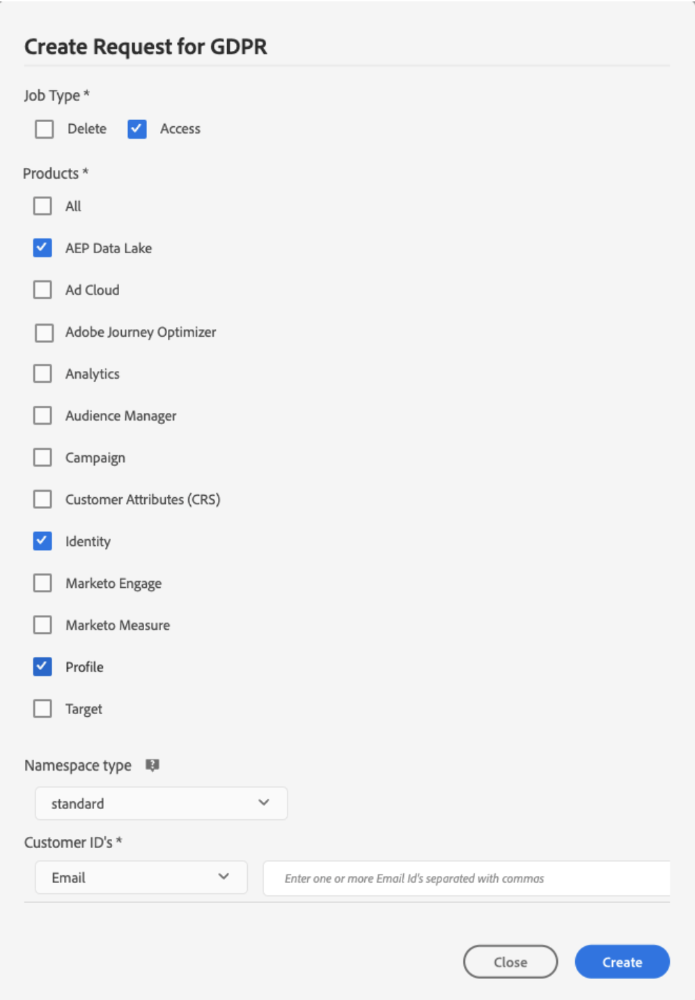

# Privacyverzoeken {#privacy-requests}

Nadat u een compositie hebt gemaakt, worden de resulterende doelgroepen opgeslagen in Adobe Experience Platform.

U kunt privacyverzoeken om tot profielgegevens toegang te hebben en/of te schrappen die aan deze publiek door Adobe Experience Platform **Privacy Service** beantwoorden, die a [ gebruikersinterface ](https://experienceleague.adobe.com/docs/experience-platform/privacy/ui/user-guide.html?lang=nl-NL){target="_blank"}  en [ RESTful API ](https://experienceleague.adobe.com/nl/docs/experience-platform/privacy/api/overview){target="_blank"}  verstrekt om u te helpen verzoeken van klantengegevens beheren.

<!--With Privacy Service, you can submit requests to access and delete personal customer data from Adobe Experience Cloud applications, facilitating automated compliance with legal and organizational privacy regulations.

Privacy requests can be created and managed from the **[!UICONTROL Requests]** menu.

-->

>[!NOTE]
>
>Voor meer informatie over Privacy Service, verwijs naar de [ documentatie van Adobe Experience Platform ](https://experienceleague.adobe.com/docs/experience-platform/privacy/home.html?lang=nl){target="_blank"} .

U kunt individuele verzoeken tot stand brengen en beheren om tot klantengegevens van de Compositie van de Federatieve Audience van Adobe toegang te hebben en te schrappen. De stappen om **toegangsverzoeken** voor te leggen en **verzoeken** schrappen zijn gedetailleerd in de [ documentatie van het Profiel van de Klant in real time ](https://experienceleague.adobe.com/nl/docs/experience-platform/profile/privacy){target="_blank"} .

<!--## Manage individual data privacy requests {#data-privacy-requests}

You can submit individual requests to access and delete consumer data from Adobe Federated Audience Composition in two ways:

* Through the **Privacy Service UI**. [Learn more](https://experienceleague.adobe.com/docs/experience-platform/privacy/ui/user-guide.html?lang=nl-NL){target="_blank"}
* Through the **Privacy Service API**. [Learn more](https://experienceleague.adobe.com/nl/docs/experience-platform/privacy/api/overview){target="_blank"}

///More specific information on Privacy Service API [here](https://developer.adobe.com/experience-platform-apis/references/privacy-service/#_blank).

Privacy Service supports two types of requests: **data access** and **data deletion**.

For **access requests** and **delete requests**, specify the three following services from the UI:

* Profile (product code: "profileService" in the API)
* AEP Data Lake (product code: "aepDataLake" in the API)
* Identity (product code: "identity" in the API)

## Create Access and Delete requests

### Prerequisites

To make requests to Access and Delete data for Adobe Federated Audience Composition, you must have:

* an Adobe organization ID
* an Identity identifier of the person you want to act on and the corresponding namespace(s). For more information about identity namespaces Experience Platform, see the [identity namespace overview](https://experienceleague.adobe.com/nl/docs/experience-platform/identity/features/namespaces).

### Required field values for API requests

```json
"companyContexts":
    "namespace": imsOrgID
    "value": <Your Adobe Organization ID Value>

"users":
    "action": either access or delete

    "userIDs":
        "namespace": e.g. email, aaid, ecid, etc.
        "type": standard
        "value": <Data Subject's Identity Identifier>

"include":
    profileService (product code for Profile)
    aepDataLake (product code for AEP Data Lake)
    identity (product code for Identity)

"regulation":
    gdpr, ccpa, pdpa, lgpd_bra, or nzpa_nzl (which is the privacy regulation that applies to the request)
```


### GDPR Access request example

From the UI:

{width="60%" align="center"}

Through the API:

```json
// JSON Request
{
   "companyContexts":[
      {
         "namespace":"imsOrgID",
         "value":"745F37C35E4B776E0A49421B@AdobeOrg"
      }
   ],
   "users":[
      {
         "action":[
            "access"
         ],
         "userIDs":[
            {
               "namespace":"ecid",
               "value":"38400000-8cf0-11bd-b23e-10b96e40000d",
               "type":"standard"
            },
            {
               "namespace":"email",
               "value":"johndoe4@gmail.com",
               "type":"standard"
            }
         ]
      }
   ],
   "include":[
    "profileService", "aepDataLake", "identity"
   ],
   "regulation":"gdpr"
}
```

```json
// JSON Response
{
    "requestId": "17163122360480365RX-705",
    "totalRecords": 1,
    "jobs": [
        {
            "jobId": "e709b1f4-1796-11ef-b422-eddd0aebc40d",
            "customer": {
                "user": {
                    "key": "John Doe",
                    "action": [
                        "access"
                    ],
                    "userIDs": [
                        {
                            "namespace": "ecid",
                            "value": "38400000-8cf0-11bd-b23e-10b96e40000d",
                            "type": "standard",
                            "namespaceId": 4,
                            "isDeletedClientSide": false
                        },
                        {
                            "namespace": "email",
                            "value": "johndoe4@gmail.com",
                            "type": "standard",
                            "namespaceId": 6,
                            "isDeletedClientSide": false
                        }
                    ]
                }
            }
        }
    ]
}
```

### GDPR Delete request example

From the UI:

{width="60%" align="center"}

Through the API:

```json
// JSON Request
{
  "companyContexts": [
    {
      "namespace": "imsOrgID",
      "value": "745F37C35E4B776E0A49421B@AdobeOrg"
    }
  ],
  "users": [
    {
      "action": [
          "delete"
      ],
      "userIDs": [
        {
          "namespace": "ecid",
          "value": "38400000-8cf0-11bd-b23e-10b96e40000d",
          "type": "standard"
        },
                {
          "namespace": "email",
          "value": "johndoe4@gmail.com",
          "type": "standard"
        }
      ]
    }
  ],
  "include": [
    "profileService", "aepDataLake", "identity"
  ],
  "regulation": "gdpr"
}
```

```json
// JSON Response
{
    "requestId": "17163122360480365RX-705",
    "totalRecords": 1,
    "jobs": [
        {
            "jobId": "e709b1f4-1796-11ef-b422-eddd0aebc40d",
            "customer": {
                "user": {
                    "key": "John Doe",
                    "action": [
                        "delete"
                    ],
                    "userIDs": [
                        {
                            "namespace": "ecid",
                            "value": "38400000-8cf0-11bd-b23e-10b96e40000d",
                            "type": "standard",
                            "namespaceId": 4,
                            "isDeletedClientSide": false
                        },
                        {
                            "namespace": "email",
                            "value": "johndoe4@gmail.com",
                            "type": "standard",
                            "namespaceId": 6,
                            "isDeletedClientSide": false
                        }
                    ]
                }
            }
        }
    ]
}
```
-->