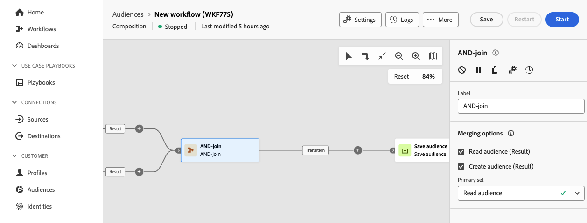

# AND-join {#join}

>[!CONTEXTUALHELP]
>id="dc_orchestration_and-join"
>title="AND-join-activiteit"
>abstract="De **en-sluit zich aan** activiteit staat u toe om veelvoudige uitvoertakken van een samenstelling te synchroniseren. De regeling wordt in werking gesteld zodra alle voorgaande activiteiten zijn beëindigd. Dit staat u toe om ervoor te zorgen dat bepaalde activiteiten alvorens de samenstelling te blijven uitvoeren worden gebeëindigd."

**EN-sluit zich** activiteit aan staat u toe om veelvoudige uitvoertakken van een samenstelling te synchroniseren.

Deze activiteit brengt slechts zijn uitgaande overgang teweeg zodra alle binnenkomende overgangen worden geactiveerd, met andere woorden, zodra alle voorafgaande activiteiten zijn geëindigd. Hierdoor kunt u ervoor zorgen dat bepaalde activiteiten zijn voltooid voordat u doorgaat met het uitvoeren van de compositie.

## Vorm en verbind activiteit {#and-join-configuration}

>[!CONTEXTUALHELP]
>id="dc_orchestration_and-join_merging"
>title="Vorm EN-verbind activiteit"
>abstract="Selecteer de activiteiten waaraan u wilt deelnemen. Kies in de vervolgkeuzelijst **[!UICONTROL Primary set]** welke binnenkomende overgangspopulatie u wilt behouden."

Voer de volgende stappen uit om de **EN-lid** activiteit te vormen:

1. Voeg meerdere activiteiten toe om minstens twee verschillende uitvoeringstakken te vormen.
1. Voeg **toe EN-sluit** activiteit aan om het even welke takken.

   

1. Controleer in de sectie **[!UICONTROL Merging options]** alle vorige activiteiten die u wilt synchroniseren.
1. Kies in de vervolgkeuzelijst **[!UICONTROL Primary set]** welke binnenkomende overgangspopulatie u wilt behouden. De uitgaande overgang kan slechts één van de binnenkomende overgangspopulaties bevatten. Als de activiteit niet wordt gevormd, zal de uitgaande overgang willekeurig één van de binnenkomende populaties selecteren.
