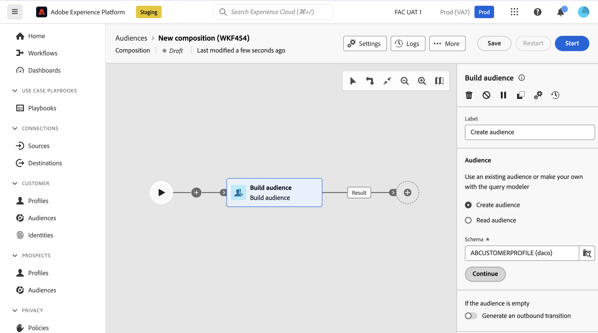

# publiek opbouwen {#build-audience}

>[!CONTEXTUALHELP]
>id="dc_orchestration_build_audience"
>title="Activiteit voor publiek opbouwen"
>abstract="**bouwt publieksactiviteit** toestaat u om het publiek te bepalen dat de samenstelling zal ingaan."

**bouwt publieksactiviteit** toestaat u om het publiek te bepalen dat de samenstelling zal ingaan. Om de publieksbevolking te bepalen, kunt u:

* Selecteer een bestaand Adobe Experience Platform-publiek.
* Creeer een nieuw publiek met de vraagmodeler door het filtreren criteria te bepalen en te combineren.

## Vorm de het publieksactiviteit van de Bouwstijl {#build-audience-configuration}

>[!CONTEXTUALHELP]
>id="dc_orchestration_build_audience_audienceselector"
>title="Doelgroep"
>abstract="Selecteer uw publiek."

Volg deze stappen om **te vormen bouwen publiek** activiteit:

1. Voeg a **toe bouwt publiek** activiteit.
1. Definieer een label.
1. Geef op of u een audio wilt maken of een bestaande audio wilt selecteren.
1. Configureer uw publiek door de stappen uit te voeren die in de onderstaande tabbladen worden beschreven.

>[!BEGINTABS]

>[!TAB  creeer publiek ]

Voer de volgende stappen uit om uw eigen publiek te maken:

1. Selecteer **tot publiek** leiden.
1. Kies het **Schema**, die ook als het richten dimensie wordt bekend. Met het schema kunt u de doelgroep voor de bewerking definiëren: ontvangers, begunstigden van contracten, operator, abonnees, enzovoort. Standaard is het schema geselecteerd bij de ontvangers.

   

1. Klik **verdergaan**.
1. Gebruik de vraagmodeler om uw vraag te bepalen dan bevestig. [ Leer hoe te met de vraagmodelaar ](../../query/query-modeler-overview.md) te werken

>[!TAB Doelgroep lezen]

Voer de volgende stappen uit om een bestaand publiek te selecteren:

1. Selecteer **Gelezen publiek**.
1. Klik **verdergaan**.

   

1. Selecteer uw publiek.

>[!ENDTABS]

>[!NOTE]
>
>**produceert een uitgaande overgang** optie staat u toe om een uitgaande overgang toe te voegen die aan het eind van de uitvoering van de activiteit zal worden geactiveerd als de publiekspopulatie leeg is.

<!--
## Examples{#build-audience-examples}

Here is an example of a workflow with two **Build audience** activities. The first one targets the poker players audience, followed by an email delivery. The second one targets the VIP clients audience, followed by an SMS delivery.

-->
