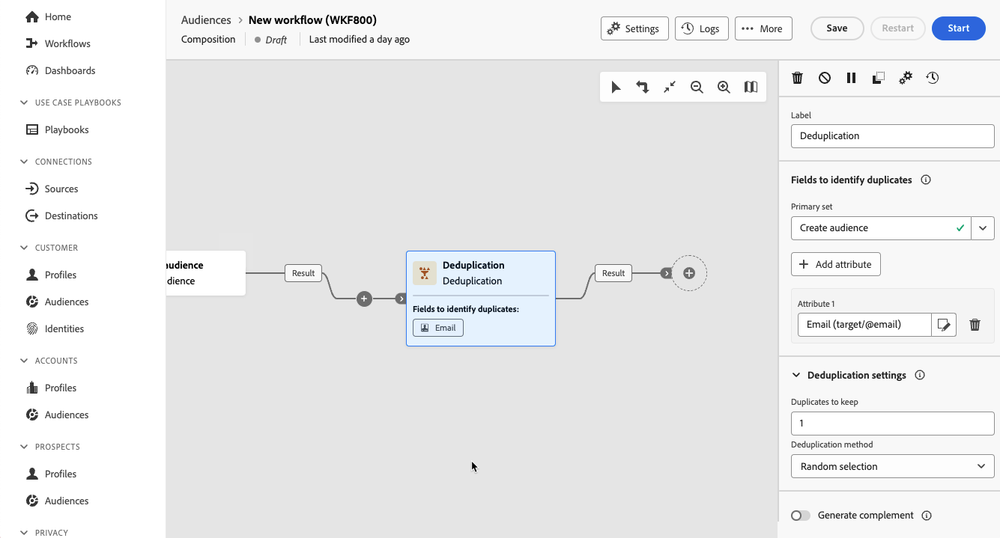

# Deduplicatie {#deduplication}

>[!CONTEXTUALHELP]
>id="dc_orchestration_deduplication_fields"
>title="Velden om duplicaten te identificeren"
>abstract="Klik in de sectie **[!UICONTROL Fields to identify duplicates]** op de knop **[!UICONTROL Add attribute]** om de velden op te geven waarvoor de duplicaten met identieke waarden kunnen worden geïdentificeerd, zoals: e-mailadres, voornaam, achternaam, enz. In de volgorde van de velden kunt u opgeven welke velden eerst moeten worden verwerkt."

>[!CONTEXTUALHELP]
>id="dc_orchestration_deduplication"
>title="Deduplicatieactiviteit"
>abstract="De **Deduplicatie** activiteit staat u toe om duplicaten in de resultaten van de binnenkomende activiteiten te schrappen. Het wordt meestal gebruikt na doelgerichte activiteiten en vóór activiteiten die het gebruik van gerichte gegevens mogelijk maken."

>[!CONTEXTUALHELP]
>id="dc_orchestration_deduplication_complement"
>title="Een complement genereren"
>abstract="U kunt een extra uitgaande overgang met de resterende bevolking produceren, die als duplicaat werd uitgesloten. Schakel hiertoe de optie **[!UICONTROL Generate complement]** in"

>[!CONTEXTUALHELP]
>id="dc_orchestration_deduplication_settings"
>title="Instellingen voor deduplicatie"
>abstract="Als u duplicaten van binnenkomende gegevens wilt verwijderen, definieert u de deduplicatiemethode in de onderstaande velden. Standaard wordt slechts één record bewaard. U moet ook de deduplicatiemodus selecteren op basis van een expressie of een kenmerk. Standaard wordt de record die buiten de duplicaten moet blijven, willekeurig geselecteerd."

De **Deduplicatie** activiteit staat u toe om duplicaten in het resultaat(en) van de binnenkomende activiteiten, bijvoorbeeld gedupliceerde profielen in de ontvankelijke lijst te schrappen. De **Deduplicatie** activiteit wordt over het algemeen gebruikt na het richten van activiteiten, en vóór activiteiten die het gebruik van gerichte gegevens toestaan.

## De deduplicatieactiviteit configureren{#deduplication-configuration}

Voer de volgende stappen uit om de **Deduplication** -activiteit te configureren:

1. Voeg de activiteit van de a **Deduplicatie** aan uw samenstelling toe.

1. Als de activiteit verscheidene binnenkomende overgangen heeft, selecteer de overgang om deduplicatie uit te voeren van de **[!UICONTROL Primary set]** drop-down lijst

1. Klik in de sectie **[!UICONTROL Fields to identify duplicates]** op de knop **[!UICONTROL Add attribute]** om de velden op te geven waarvoor de duplicaten met identieke waarden kunnen worden geïdentificeerd, zoals: e-mailadres, voornaam, achternaam, enz. In de volgorde van de velden kunt u opgeven welke velden eerst moeten worden verwerkt.

   

1. Selecteer in de sectie **[!UICONTROL Deduplication settings]** het aantal unieke **[!UICONTROL Duplicates to keep]** . De standaardwaarde voor dit veld is 1. Met de waarde 0 kunt u alle duplicaten behouden.

   Stel bijvoorbeeld dat records A en B worden beschouwd als duplicaten van record Y en dat een record C wordt beschouwd als duplicaat van record Z:

   * Als de waarde van het veld 1 is: alleen de records Y en Z blijven behouden.
   * Als de waarde van het veld 0 is: alle records blijven behouden.
   * Als de waarde van het veld 2 is: de records C en Z blijven behouden en twee records van A, B en Y blijven behouden, bij toeval of afhankelijk van de daarna geselecteerde deduplicatiemethode.

1. Selecteer de **[!UICONTROL Deduplication method]** die u wilt gebruiken:

   * **[!UICONTROL Random selection]** - Hiermee selecteert u willekeurig de record die u uit de duplicaten wilt verwijderen.
   * **[!UICONTROL Using an expression]**: bewaar de records waarin de waarde van de ingevoerde expressie het kleinst of het grootst is.
   * **[!UICONTROL Non-empty values]**: bewaar de records waarvoor de expressie niet leeg is.
   * **[!UICONTROL Following a list of values]** - Definieer een waardeprioriteit voor een of meer velden. Als u de waarden wilt definiëren, klikt u op **[!UICONTROL Attribute]** om een veld te selecteren of maakt u een expressie. Vervolgens voegt u de waarde(n) toe aan de desbetreffende tabel. Als u een nieuw veld wilt definiëren, klikt u op de **[!UICONTROL Add button]** boven de lijst met waarden.

1. Schakel de optie **[!UICONTROL Generate complement]** in als u de resterende populatie wilt benutten. Het complement bestaat uit alle duplicaten. Er wordt dan een aanvullende overgang toegevoegd aan de activiteit.

<!--
## Example{#deduplication-example}

In the following example, use a deduplication activity to exclude duplicates from the target before sending a delivery. The identified duplicated profiles are added to a dedicated audience that can be reused if necessary. Choose the **Email** address to identify the duplicates. Keep 1 entry and select the **Random** deduplication method.

-->
