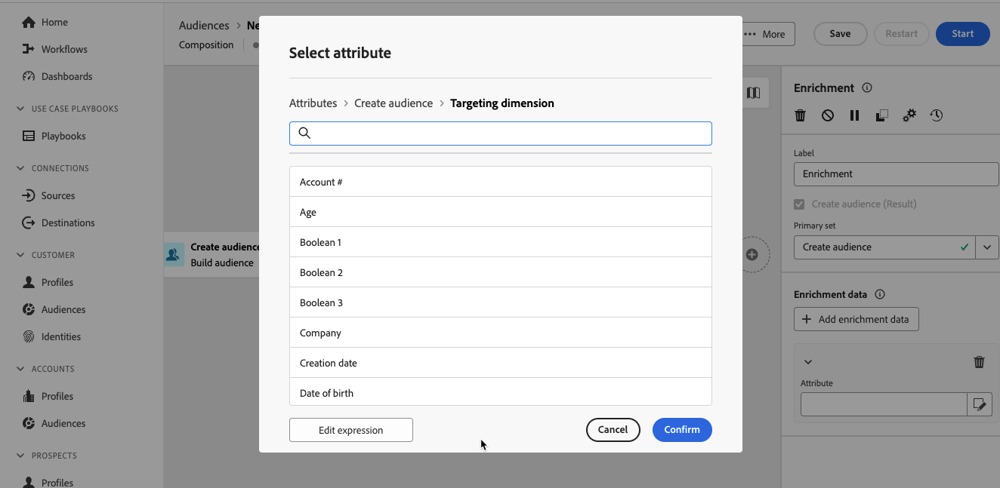

# Verrijking {#enrichment}

>[!CONTEXTUALHELP]
>id="dc_orchestration_enrichment"
>title="Verrijkingsactiviteit"
>abstract="De **Verrijking** activiteit staat u toe om de gerichte gegevens met extra informatie van het gegevensbestand te verbeteren. Het wordt algemeen gebruikt in een samenstelling na segmentatieactiviteiten."

>[!CONTEXTUALHELP]
>id="dc_orchestration_enrichment_data"
>title="Verrijkingsactiviteit"
>abstract="Zodra de verrijkingsgegevens aan de samenstelling zijn toegevoegd, kan het in de activiteiten worden gebruikt die na de **Verrijking** activiteit aan segmentprofielen in verschillende groepen worden toegevoegd die op hun gedrag, voorkeur, en keuzen worden gebaseerd."

>[!CONTEXTUALHELP]
>id="dc_orchestration_enrichment_simplejoin"
>title="Koppelingsdefinitie"
>abstract="Maak een koppeling tussen de gegevens van de werktabel en de gefedereerde database."

>[!CONTEXTUALHELP]
>id="dc_orchestration_enrichment_reconciliation"
>title="Verrijkingsverzoening"
>abstract="Stel de afstemmingsparameters in."

>[!CONTEXTUALHELP]
>id="dc_targetdata_personalization_enrichmentdata"
>title="Verrijkingsgegevens"
>abstract="Selecteer de gegevens die u wilt gebruiken om uw compositie te verrijken. U kunt twee soorten verrijkingsgegevens selecteren: één enkel verrijkingsattribuut van het schema, dat ook als het richten van afmeting wordt bekend, of een inzamelingsverbinding, die een verbinding met een 1-N kardinaliteit tussen lijsten is."

De **Verrijking** activiteit staat u toe om de gerichte gegevens met extra informatie van het gefedereerde gegevensbestand te verbeteren. Het wordt algemeen gebruikt in een samenstelling na segmentatieactiviteiten.

Als u een verbinding aan de Federatieve bestemming van de Samenstelling van het Publiek hebt gevormd, kunt u de activiteit van de Verrijking gebruiken om gegevens te verrijken die Adobe Experience Platform met attributen van uw extern gegevensbestand komen. [ Leer hoe te om het publiek van Adobe Experience Platform met externe gegevens te verrijken ](../../connections/destinations.md)

Verrijkingsgegevens kunnen worden verkregen:

* **van de zelfde het werklijst** zoals die in uw samenstelling wordt gericht:

  *Doel een groep klanten en voeg het &quot;datum&quot;gebied van de Geboorteplaats aan de huidige het werklijst* toe.

* **van een andere het werklijst**:

  *Beoogd een groep klanten en voeg de &quot;Bedrag&quot;en &quot;Type van product&quot;gebieden toe die uit de &quot;lijst van de Aankoop&quot;komen*.

Zodra de verrijkingsgegevens aan de samenstelling zijn toegevoegd, kan het in de activiteiten worden gebruikt die na de **Verrijking** activiteit worden toegevoegd om klanten in verschillende groepen te segmenteren die op hun gedrag, voorkeur, en keuzen worden gebaseerd.

<!--For instance, you can add to the working table information related to customers' purchases and use this data to personalize emails with their latest purchase or the amount spent on these purchases.-->

## De verrijkingsactiviteit configureren {#enrichment-configuration}

Volg deze stappen om de **1} activiteit van de Verrijking {te vormen:**

1. Voeg activiteiten zoals **toe bouwt publiek** en **combineer** activiteiten.
1. Voeg een **Verrijking** activiteit toe.

   

1. Als er meerdere overgangen zijn geconfigureerd in uw compositie, kunt u het veld **[!UICONTROL Primary set]** gebruiken om te definiëren welke overgang moet worden gebruikt als primaire set om te verrijken met gegevens.

1. Klik **toevoegen verrijkingsgegevens** en selecteer de attributen om de gegevens te gebruiken te verrijken.

   

   >[!NOTE]
   >
   >De **geeft uitdrukkingsknoop** in het scherm van de attributenselectie uit staat u toe om geavanceerde uitdrukkingen te bouwen om de attributen te selecteren.

<!--PAS VU SUR INSTANCE: You can select two types of enrichment data: a single enrichment attribute from the target dimension, or a collection link. Each of these types is detailed in the examples below:

    * [Single enrichment attribute](#single-attribute)
    * [Collection lnk](#collection-link)-->

<!--
## Examples {#example}

### Single enrichment attribute {#single-attribute}

Here, we are just adding a single enrichment attribute, for example, the date of birth. Follow these steps:

1. Click inside the **Attribute** field.
1. Select a simple field from the schema, also known as targeting dimension, the date of birth in our example. 
1. Click **Confirm**.
-->
<!--### Collection link {#collection-link}

In this more complex use case, we will select a collection link which is a link with a 1-N cardinality between tables. Let's retrieve the three latest purchases that are less than 100$. For this you need to define:

* an enrichment attribute: the **Total amount** field
* the number of lines to retrieve: 3
* a filter: filter out items that are greater than 100$
* a sorting: descendant sorting on the **Order date** field. 

#### Add the attribute {#add-attribute}

This is where you select the collection link to use as enrichment data.

1. Click inside the **Attribute** field.
1. Click **Display advanced attributes**.
1. Select the **Total amount** field from the **Purchases** table. 

#### Define the collection settings{#collection-settings}

Then, define how the data is collected and the number of records to retrieve.

1. Select **Collect data** in the **Select how the data is collected** drop-down.
1. Type "3" in the **Lines to retrieve (Columns to create)** field. 

If you want, for example, to get the average amount of purchases for a customer, select **Aggregated data** instead, and select **Average** in the **Aggregate function** drop-down.

#### Define the filters{#collection-filters}

Here, we define the maximum value for the enrichment attribute. We filter out items that are greater than 100$. [Learn how to work with the query modeler](../../query/query-modeler-overview.md)

1. Click **Edit filters**.
1. Add the two following filters: **Total amount** exists AND **Total amount** is less than 100. The first one filters NULL values as they would appear as the greatest value.
1. Click **Confirm**.

#### Define the sorting{#collection-sorting}

We now need to apply sorting in order to retrieve the three **latest** purchases.

1. Activate the **Enable sorting** option.
1. Click inside the **Attribute** field.
1. Select the **Order date** field.
1. Click **Confirm**. 
1. Select **Descending** from the **Sort** drop-down.-->
