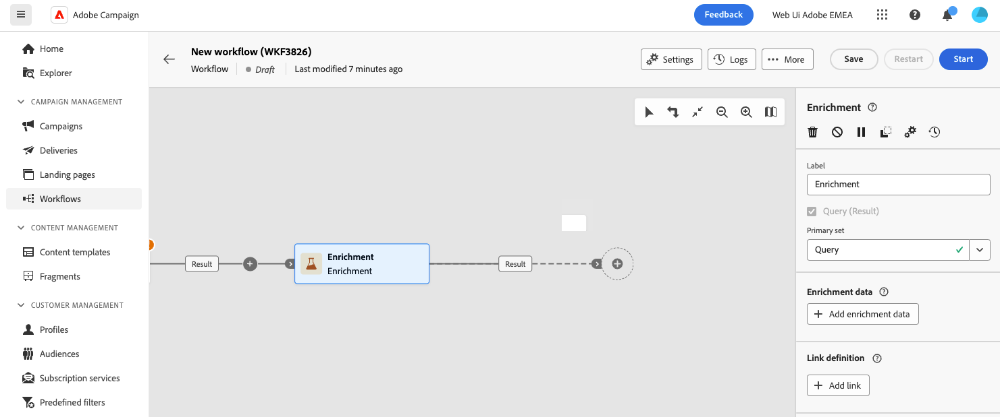

# Verrijking {#enrichment}

>[!CONTEXTUALHELP]
>id="dc_orchestration_enrichment"
>title="Verrijkingsactiviteit"
>abstract="De **Verrijking** Met deze activiteit kunt u de doelgegevens verbeteren met aanvullende informatie uit de database. Het wordt algemeen gebruikt in een samenstelling na segmentatieactiviteiten."

>[!CONTEXTUALHELP]
>id="dc_orchestration_enrichment_data"
>title="Verrijkingsactiviteit"
>abstract="Zodra de verrijkingsgegevens aan de samenstelling zijn toegevoegd, kunnen zij worden gebruikt in de activiteiten die na de **Verrijking** activiteit om profielen in verschillende groepen te segmenteren die op hun gedrag, voorkeur, en keuzen worden gebaseerd."

>[!CONTEXTUALHELP]
>id="dc_orchestration_enrichment_simplejoin"
>title="Koppelingsdefinitie"
>abstract="Maak een koppeling tussen de gegevens van de werktabel en de gefedereerde database."

>[!CONTEXTUALHELP]
>id="dc_orchestration_enrichment_reconciliation"
>title="Verrijkingsverzoening"
>abstract="Stel de afstemmingsparameters in."

>[!CONTEXTUALHELP]
>id="dc_targetdata_personalization_enrichmentdata"
>title="Verrijkingsgegevens"
>abstract="Selecteer de gegevens die u wilt gebruiken om uw compositie te verrijken. U kunt twee soorten verrijkingsgegevens selecteren: één enkel verrijkingsattribuut van de doelafmeting, of een inzamelingsverbinding, die een verbinding met een 1-N kardinaliteit tussen lijsten is."

De **Verrijking** de activiteit staat u toe om de gerichte gegevens met extra informatie van het gefedereerde gegevensbestand te verbeteren. Het wordt doorgaans gebruikt in composities na segmentatieactiviteiten.

Verrijkingsgegevens kunnen worden verkregen:

* **Van dezelfde werktabel** als doelgroep in uw samenstelling:

  *Stel een groep klanten in en voeg het veld Geboortedatum toe aan de huidige tabel*.

* **Van een andere werktabel**:

  *Selecteer een groep klanten en voeg de velden Bedrag en Type product uit de tabel Aankoop toe*.

Zodra de verrijkingsgegevens aan de samenstelling zijn toegevoegd, kunnen ze worden gebruikt in de activiteiten die na de **Verrijking** activiteit om klanten in verschillende groepen te segmenteren die op hun gedrag, voorkeur, en keuzen worden gebaseerd.

<!--For instance, you can add to the working table information related to customers' purchases and use this data to personalize emails with their latest purchase or the amount spent on these purchases.-->

## De verrijkingsactiviteit configureren {#enrichment-configuration}

Voer de volgende stappen uit om de **Verrijking** activiteit:

1. Voeg activiteiten toe zoals **publiek opbouwen** en **Combineren** activiteiten.
1. Een **Verrijking** activiteit.

   

1. Als de veelvoudige overgangen in uw samenstelling zijn gevormd, kunt u gebruiken **[!UICONTROL Primary set]** veld om te bepalen welke overgang moet worden gebruikt als primaire set om te verrijken met gegevens.

1. Klikken **Verrijkingsgegevens toevoegen** en selecteert u het kenmerk dat u wilt gebruiken om de gegevens te verrijken.

   

   >[!NOTE]
   >
   >De **De knop Expressie bewerken** in het selectiescherm voor kenmerken kunt u geavanceerde expressies maken om het kenmerk te selecteren.

<!--PAS VU SUR INSTANCE: You can select two types of enrichment data: a single enrichment attribute from the target dimension, or a collection link. Each of these types is detailed in the examples below:

    * [Single enrichment attribute](#single-attribute)
    * [Collection lnk](#collection-link)-->

## Voorbeelden {#example}

### Enkel verrijkingskenmerk {#single-attribute}

Hier voegen we slechts één verrijkingskenmerk toe, bijvoorbeeld de geboortedatum. Voer de volgende stappen uit:

1. Klik in het dialoogvenster **Kenmerk** veld.
1. Selecteer een eenvoudig veld in de doeldimensie, de geboortedatum in ons voorbeeld.
1. Klikken **Bevestigen**.

<!--### Collection link {#collection-link}

In this more complex use case, we will select a collection link which is a link with a 1-N cardinality between tables. Let's retrieve the three latest purchases that are less than 100$. For this you need to define:

* an enrichment attribute: the **Total amount** field
* the number of lines to retrieve: 3
* a filter: filter out items that are greater than 100$
* a sorting: descendant sorting on the **Order date** field. 

#### Add the attribute {#add-attribute}

This is where you select the collection link to use as enrichment data.

1. Click inside the **Attribute** field.
1. Click **Display advanced attributes**.
1. Select the **Total amount** field from the **Purchases** table. 

#### Define the collection settings{#collection-settings}

Then, define how the data is collected and the number of records to retrieve.

1. Select **Collect data** in the **Select how the data is collected** drop-down.
1. Type "3" in the **Lines to retrieve (Columns to create)** field. 

If you want, for example, to get the average amount of purchases for a customer, select **Aggregated data** instead, and select **Average** in the **Aggregate function** drop-down.

#### Define the filters{#collection-filters}

Here, we define the maximum value for the enrichment attribute. We filter out items that are greater than 100$. [Learn how to work with the query modeler](../../query/query-modeler-overview.md)

1. Click **Edit filters**.
1. Add the two following filters: **Total amount** exists AND **Total amount** is less than 100. The first one filters NULL values as they would appear as the greatest value.
1. Click **Confirm**.

#### Define the sorting{#collection-sorting}

We now need to apply sorting in order to retrieve the three **latest** purchases.

1. Activate the **Enable sorting** option.
1. Click inside the **Attribute** field.
1. Select the **Order date** field.
1. Click **Confirm**. 
1. Select **Descending** from the **Sort** drop-down.-->
