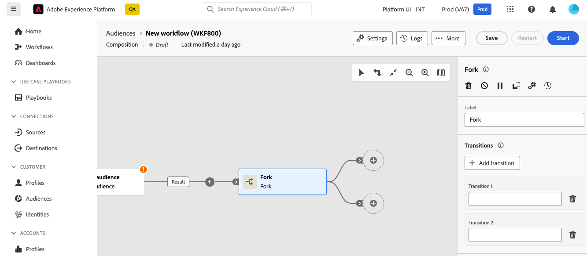

# Vertakking {#fork}

>[!CONTEXTUALHELP]
>id="dc_orchestration_fork"
>title="Vorkactiviteit"
>abstract="De **activiteit 0} van het Vonk {staat u toe om uitgaande overgangen tot stand te brengen om verscheidene activiteiten tezelfdertijd te beginnen.**"

>[!CONTEXTUALHELP]
>id="dc_orchestration_fork_transitions"
>title="Overgangen naar vorkactiviteit"
>abstract="Door gebrek, worden twee overgangen gecreeerd met de activiteit van het a **Fork**. Klik **toevoegen overgangsknoop** om een extra uitgaande overgang te bepalen, en zijn etiket in te gaan."

De **activiteit 0} van het Vonk {staat u toe om uitgaande overgangen tot stand te brengen om verscheidene activiteiten tezelfdertijd te beginnen.**

## De vorkactiviteit configureren {#fork-configuration}

Volg deze stappen om de **1} activiteit van het Fork {te vormen:**

1. Voeg de activiteit van het a **Vonk** aan uw samenstelling toe.
1. Klik **toevoegen overgang** om een nieuwe uitgaande overgang toe te voegen. Standaard zijn twee overgangen gedefinieerd.
1. Voeg een label toe aan elk van uw overgangen.

   
