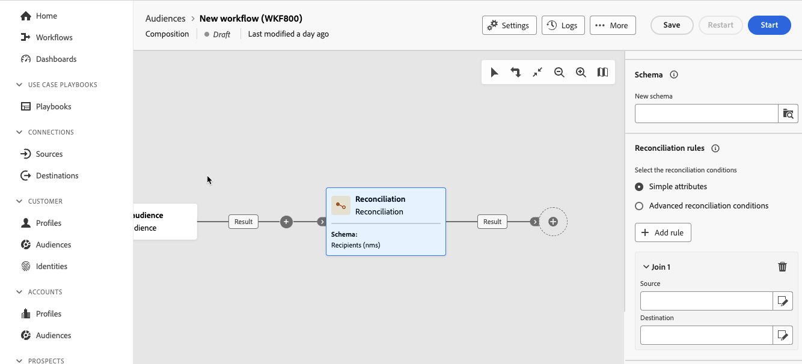

# Afstemming {#reconciliation}

>[!CONTEXTUALHELP]
>id="dc_orchestration_reconciliation"
>title="Afstemmingsactiviteit"
>abstract="De **Verzoening** U kunt de koppeling definiëren tussen de gegevens in de database en de gegevens in een werktabel."

>[!CONTEXTUALHELP]
>id="dc_orchestration_reconciliation_field"
>title="Selectieveld Afstemmen"
>abstract="Selectieveld Afstemmen"

>[!CONTEXTUALHELP]
>id="dc_orchestration_reconciliation_condition"
>title="Afstemming maken, voorwaarde"
>abstract="Afstemming maken, voorwaarde"

>[!CONTEXTUALHELP]
>id="dc_orchestration_reconciliation_complement"
>title="Afstemming genereren"
>abstract="Afstemming genereren"

De **Verzoening** Met activiteit kunt u de koppeling definiëren tussen de gegevens in de database en de gegevens in een werktabel, bijvoorbeeld gegevens die zijn geladen van een extern systeem.

<!--For example, the **Reconciliation** activity can be placed after a **Load file** activity to import non-standard data into the database. In this case, the **Reconciliation** activity lets you define the link between the data in the Adobe Campaign database and the data in the work table.-->

De **Verzoening** Met activiteit kunt u niet-geïdentificeerde gegevens koppelen aan bestaande bronnen. De verzoeningsverrichting impliceert dat de gegevens u zich aansluit bij reeds in het gegevensbestand zijn. Als u bijvoorbeeld informatie over aankopen wilt afstemmen waarin wordt aangegeven welk product is aangeschaft, op welk tijdstip, door welke client, enzovoort, moeten het product en de client al in de database aanwezig zijn.

## De afstemmingsactiviteit configureren {#reconciliation-configuration}

>[!CONTEXTUALHELP]
>id="dc_orchestration_reconciliation_targeting"
>title="Schema"
>abstract="Selecteer het nieuwe schema dat op de gegevens moet worden toegepast. Met een schema, ook wel doeldimensie genoemd, kunt u de doelpopulatie definiëren: ontvangers, abonnementen op apps, operators, abonnees, enz. Door gebrek, wordt de samenstelling huidige schema geselecteerd."

>[!CONTEXTUALHELP]
>id="dc_orchestration_reconciliation_rules"
>title="Afstemmingsregels"
>abstract="Selecteer afstemmingsregels die u wilt gebruiken voor de deduplicatie. Als u kenmerken wilt gebruiken, selecteert u de **Eenvoudige kenmerken** en kiest u de bron- en doelvelden. Als u uw eigen afstemmingsvoorwaarde wilt maken met de querymodelfunctie, selecteert u de optie **Geavanceerde afstemmingsvoorwaarden** -optie."

>[!CONTEXTUALHELP]
>id="dc_orchestration_reconciliation_targeting_selection"
>title="Doeldimensie selecteren"
>abstract="Selecteer het schema, dat ook als het richten dimensie wordt bekend, voor uw binnenkomende gegevens met elkaar in overeenstemming te brengen."

>[!CONTEXTUALHELP]
>id="dc_orchestration_keep_unreconciled_data"
>title="Niet-compatibele gegevens behouden"
>abstract="Door gebrek, worden de niet in overeenstemming gebrachte gegevens gehouden in de uitgaande overgang en beschikbaar in de werklijst voor toekomstig gebruik. Als u niet-compatibele gegevens wilt verwijderen, desactiveert u het dialoogvenster **Niet-compatibele gegevens behouden** -optie."

>[!CONTEXTUALHELP]
>id="dc_orchestration_reconciliation_attribute"
>title="Afstemmingskenmerk"
>abstract="Selecteer het kenmerk dat u wilt gebruiken om gegevens op elkaar af te stemmen en om te bevestigen."

Voer de volgende stappen uit om de **Verzoening** activiteit:

1. Voeg een **Verzoening** activiteit in uw samenstelling.

1. Selecteer de **Nieuw schema**. Met een schema, ook wel doeldimensie genoemd, kunt u de doelpopulatie definiëren: ontvangers, abonnementen op apps, operators, abonnees, enz.

1. Selecteer de velden die u wilt gebruiken voor de afstemming. U kunt een of meer verzoeningscriteria gebruiken.

   1. Als u kenmerken wilt gebruiken om gegevens op elkaar af te stemmen, selecteert u de optie **Eenvoudige kenmerken** klikt u op de knop **Regel toevoegen** knop.
   1. Selecteer de **Source** en **Doel** velden voor de afstemming. De **Source** veld. De **Doel** komt overeen met de velden van het geselecteerde schema.

      De gegevens worden in overeenstemming gebracht wanneer bron en bestemming gelijk zijn. Selecteer bijvoorbeeld de **E-mail** velden voor het dupliceren van profielen op basis van hun e-mailadres.

      Klik op de knop **Regel toevoegen** knop. Als er meerdere samenvoegvoorwaarden zijn opgegeven, moeten deze ALLES worden gecontroleerd zodat de gegevens aan elkaar kunnen worden gekoppeld.

      

   1. Als u andere kenmerken wilt gebruiken om gegevens met elkaar te verzoenen, selecteert u de optie **Geavanceerde afstemmingsvoorwaarden** klikt u op de knop **Voorwaarden maken** knop. U kunt dan uw eigen verzoeningsvoorwaarde tot stand brengen gebruikend de vraagmodeler.

      

1. U kunt gegevens filteren om te verzoenen met de **Filter maken** knop. Hiermee kunt u een aangepaste voorwaarde maken met behulp van de querymodelfunctie.

Door gebrek, worden de niet in overeenstemming gebrachte gegevens gehouden in de uitgaande overgang en beschikbaar in de werkbare lijst voor toekomstig gebruik. Als u niet-compatibele gegevens wilt verwijderen, desactiveert u het dialoogvenster **Niet-compatibele gegevens behouden** -optie.

<!--
## Example {#reconciliation-example}

The following example demonstrates a workflow that creates an audience of profiles directly from an imported file containing new clients. It is made up of the following activities:

The workflow is designed as follows:


 
It is built with the following activities:

* A [Load file](load-file.md) activity uploads a file containing profiles data that were extracted from an external tool.

    For example:

    ```
    lastname;firstname;email;birthdate;
    JACKMAN;Megan;megan.jackman@testmail.com;07/08/1975;
    PHILLIPS;Edward;phillips@testmail.com;09/03/1986;
    WEAVER;Justin;justin_w@testmail.com;11/15/1990;
    MARTIN;Babe;babeth_martin@testmail.net;11/25/1964;
    REESE;Richard;rreese@testmail.com;02/08/1987;
    ```

* A **Reconciliation** activity which identifies the incoming data as profiles, by using the **email** and **Date of birth** fields as reconciliation criteria.

    

* A [Save audience](save-audience.md) activity to create a new audience based on these updates. You can also replace the **Save audience** activity by an **End** activity if no specific audience needs to be created or updated. Recipient profiles are updated in any case when you run the workflow.


## Compatibility {#reconciliation-compat}

The **Reconciliation** activity does not exist in the Client console. All **Enrichments** activities created in the Client console with the reconciliation options enabled are displayed as **Reconciliation** activities in Campaign Web user interface.
-->
