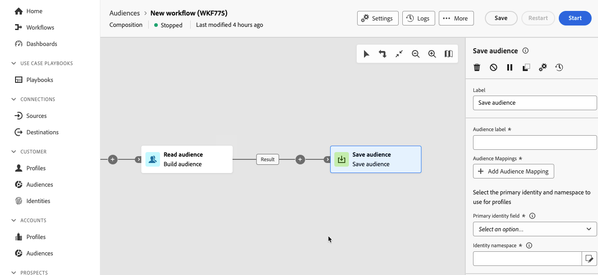

# Doelgroep opslaan {#save-audience}

>[!CONTEXTUALHELP]
>id="dc_orchestration_save_audience"
>title="Een publiek opslaan"
>abstract="Gebruik deze activiteit om een nieuw publiek van de bevolking tot stand te brengen die stroomopwaarts in de samenstelling wordt berekend. Het gecreeerde publiek wordt toegevoegd aan de lijst van publiek, en beschikbaar via het **Publiek** menu."

>[!CONTEXTUALHELP]
>id="dc_orchestration_saveaudience_outbound"
>title="Uitgaande overgang genereren"
>abstract="Gebruik deze optie als u een overgang na **wilt toevoegen sparen publiek** activiteit."

>[!CONTEXTUALHELP]
>id="dc_orchestration_save_audience_primary_identity"
>title="Primair identiteitsveld"
>abstract="Selecteer de primaire identiteit die u voor profielen wilt gebruiken."
>additional-url="https://experienceleague.adobe.com/nl/docs/experience-platform/xdm/ui/fields/identity#define-a-identity-field" text="Meer informatie in de documentatie van Experience Platform"

>[!CONTEXTUALHELP]
>id="dc_orchestration_saveaudience_namespace"
>title="Naamruimte identiteit"
>abstract="Selecteer de naamruimte die u wilt gebruiken voor profielen."
>additional-url="https://experienceleague.adobe.com/nl/docs/experience-platform/identity/features/namespaces" text="Meer informatie in de documentatie van Experience Platform"

Met de **[!UICONTROL Save audience]** -activiteit kunt u een nieuw publiek maken van de populatie die stroomopwaarts in een compositie wordt berekend. Het gecreeerde publiek wordt toegevoegd aan de lijst van het publiek van Adobe Experience Platform, en beschikbaar gemaakt via het **publiek** menu. [ leer hoe te met publiek ](../../start/audiences.md) werken

Deze activiteit wordt hoofdzakelijk gebruikt om populatiegroepen in de zelfde samenstelling te berekenen, door hen in herbruikbaar publiek om te zetten. Verbind het met andere het richten activiteiten zoals a **bouwt publiek** of a **combineer** activiteit.

De **[!UICONTROL Save Audience]** -activiteit genereert een nieuw publieksschema en de bijbehorende dataset, die persoonlijk identificeerbare informatie (PII) of beschermde gezondheidsinformatie (PHI) kan bevatten. Nadat het publiek is gemaakt, werkt u samen met de beheerder om ervoor te zorgen dat de juiste labels voor gegevensbeheer worden toegepast in overeenstemming met het gegevensbeleid van uw organisatie. Voor meer informatie over hoe te om de etiketten van het gegevensgebruik toe te passen, te lezen gelieve de [ gebruikersgids van de etiketten van het gegevensgebruik ](https://experienceleague.adobe.com/nl/docs/experience-platform/data-governance/labels/user-guide).

## Vorm sparen publieksactiviteit {#save-audience-configuration}

Volg deze stappen om **te vormen sparen publiek** activiteit:

1. Voeg a **sparen publiek** activiteit aan uw samenstelling toe.

   

1. Geef het label op van het publiek dat u wilt maken.

   >[!IMPORTANT]
   >
   >Het label van het publiek moet uniek zijn binnen de huidige sandbox. Het mag niet hetzelfde label hebben als een bestaand publiek.

1. Gebruik de sectie Toewijzingen publiek om de velden te selecteren die u wilt overbrengen met het nieuwe publiek. Om dit te doen, klik **Toewijzing van het publiek** dan toevoegen de bron en doelpublieksgebieden.

   Herhaal de bewerking om zoveel publiek-toewijzingen toe te voegen als u nodig hebt.

1. Selecteer de primaire identiteit en naamruimte die u wilt gebruiken om de doelprofielen in de database te identificeren:

   * **Primair identiteitsgebied**: Selecteer het gebied om de profielen te gebruiken te identificeren. Bijvoorbeeld zijn e-mailadres of telefoonnummer.
   * **Identiteitsnaamruimte**: Selecteer namespace aan gebruik om de profielen, d.w.z. het type van gegevens te identificeren om als identificatiesleutel te gebruiken. Bijvoorbeeld, als het e-mailadres als primair identiteitsgebied is geselecteerd, zou de identiteit namespace **E-mail** moeten worden geselecteerd. Als het unieke herkenningsteken het telefoonaantal is, dan zou de identiteit namespace **Telefoon** moeten worden geselecteerd.

## Open uw publiek in Adobe Experience Platform {#access-audience}

Na het uitvoeren van de samenstelling, wordt het resulterende publiek bewaard in Adobe Experience Platform als extern publiek, en beschikbaar in Adobe Real-Time CDP en/of Adobe Journey Optimizer binnen de Portaal van het Publiek. Voor meer informatie over het Portaal van het Publiek, gelieve het [ Poortoverzicht van het Poortpubliek van het Publiek ](https://experienceleague.adobe.com/nl/docs/experience-platform/segmentation/ui/audience-portal){target="_blank"} te lezen.

Het gemaakte publiek bevat alle velden die zijn geselecteerd in de sectie Audience Mappings (Toewijzingen publiek). U kunt deze doelgroep in Journey Optimizer activeren of activeren naar een bestemming die wordt ondersteund door Adobe Experience Platform.

[ leer meer in de documentatie van Adobe Experience Platform ](https://experienceleague.adobe.com/nl/docs/experience-platform/segmentation/ui/audience-portal){target="_blank"}

<!--

## Example{#save-audience-example}

The following example illustrates a simple audience update from targeting. A scheduler is added to run the workflow once a month. A query recovers all the profiles subscribed to the different application services available. The **Save audience** activity updates the audience by deleting profiles that have unsubscribed from the service since the last workflow execution and by adding the newly subscribed profiles.
-->
