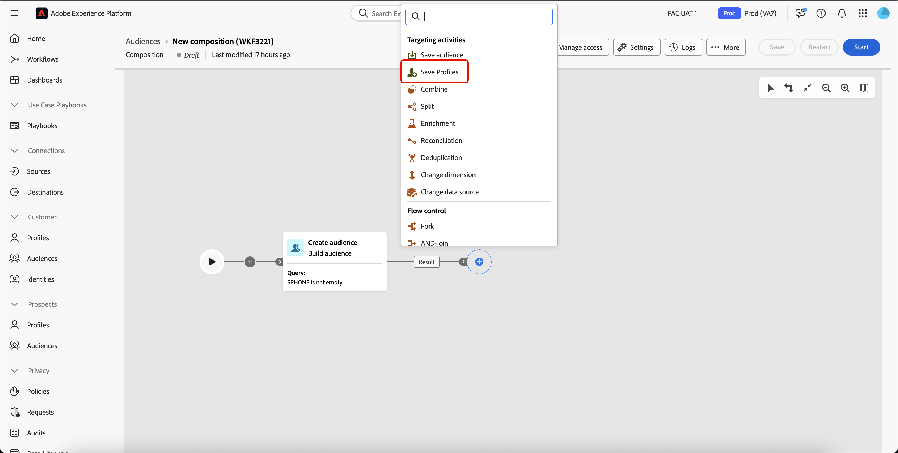

# Profielen opslaan {#save-profile}

>[!CONTEXTUALHELP]
>id="dc_orchestration_saveprofile"
>title="Profielen opslaan"
>abstract="Met de activiteit Profielen opslaan kunt u Experience Platform-profielen verrijken door gegevens van externe opslagruimten te federaliseren, zodat u klantprofielen kunt verfraaien met extra kenmerken. "

>[!CONTEXTUALHELP]
>id="dc_orchestration_saveprofile_aepschemalist"
>title="Experience Platform-schema selecteren"
>abstract="Kies het Experience Platform-schema voor de profielen."

>[!CONTEXTUALHELP]
>id="dc_orchestration_saveprofile_primaryidentitynamespace"
>title="Selecteer het veld Primaire identificatie"
>abstract="Selecteer de primaire identiteit die u wilt gebruiken om de doelprofielen in de database te identificeren."

>[!CONTEXTUALHELP]
>id="dc_orchestration_saveprofile_selectaepschema"
>title="Experience Platform-schema selecteren"
>abstract="Kies het Experience Platform-schema voor de profielen."

>[!CONTEXTUALHELP]
>id="dc_orchestration_saveprofile_updatemode"
>title="Profielupdatemodus opslaan"
>abstract="De beschikbare updatemodi voor sparen profielactiviteit omvatten volledige update en stijgende update."

>[!CONTEXTUALHELP]
>id="dc_orchestration_saveprofile_updatemode_full"
>title="Volledige update"
>abstract="De volledige updatemodus werkt de volledige set profielen voor verrijking bij."

>[!CONTEXTUALHELP]
>id="dc_orchestration_saveprofile_updatemode_incremental"
>title="Incrementele update"
>abstract="De incrementele updatemodus werkt de profielen bij die zijn gewijzigd sinds de laatste verrijking is uitgevoerd."

>[!CONTEXTUALHELP]
>id="dc_orchestration_saveprofile_primaryidentityfield"
>title="Primair identiteitsveld"
>abstract="In het veld primaire identiteit wordt de bron van de waarheid aangegeven wanneer profielen voor de verrijking worden samengevoegd."

>[!CONTEXTUALHELP]
>id="dc_orchestration_saveprofile_requiredfieldscheck"
>title="Vereiste veldcriteria"
>abstract="Een vereist veld is een kenmerk dat voor elk profiel of elke record moet worden ingevuld bij het exporteren van gegevens. Als een vereist veld ontbreekt, is het exporteren niet voltooid of geldig."

>[!CONTEXTUALHELP]
>id="dc_orchestration_saveprofile_primaryidentitycheck"
>title="Criteria van primair identiteitsveld"
>abstract="De unieke id voor elk profiel of elke record. Dit zorgt ervoor dat elke record duidelijk herkend en op elkaar afgestemd kan worden, zodat dubbele gegevens voorkomen worden."

Met de **[!UICONTROL Save Profiles]** -activiteit kunt u Adobe Experience Platform-profielen verrijken met gegevens die zijn gefederaliseerd vanuit externe opslagruimten.

Deze activiteit wordt typisch gebruikt om klantenprofielen te verbeteren door extra attributen en inzichten in te brengen zonder de gegevens fysiek te bewegen of te dupliceren in het platform.

## De [!UICONTROL Save Profiles] -activiteit configureren {#save-profile-configuration}

>[!IMPORTANT]
>
>**sparen Profielen** activiteit vereist een profiel-toegelaten schema en dataset. Leren hoe te om uw dataset toe te laten om profiel-toegelaten te zijn, te lezen gelieve de [ gids van de datasetgebruiker ](https://experienceleague.adobe.com/nl/docs/experience-platform/catalog/datasets/user-guide#enable-profile){target="_blank"}.
>
>Bovendien, als de geselecteerde dataset **niet** toegelaten upsert heeft, zullen de gegevens van de profielen **worden vervangen**. Leren hoe te om upsert voor uw datasets toe te laten, te lezen gelieve [ toelaten upsert gids ](https://experienceleague.adobe.com/nl/docs/experience-platform/catalog/datasets/enable-upsert).

Voer de volgende stappen uit om de **[!UICONTROL Save Profiles]** -activiteit te configureren:

1. Voeg een **[!UICONTROL Save Profiles]** activiteit aan uw samenstelling toe.

   {width="1500" zoomable="yes"}

1. Geef het label op van de profielen die u wilt maken.

   >[!IMPORTANT]
   >
   >Het label van het publiek moet uniek zijn binnen de huidige sandbox. Het mag niet hetzelfde label hebben als een bestaand publiek.

1. Selecteer het Adobe Experience Platform-schema dat u wilt gebruiken.

   {width="1500" zoomable="yes"}

1. Selecteer de dataset u de verrijking aan wilt bewaren.

   {width="300" zoomable="yes"}

1. Na het selecteren van de dataset, kunt u het primaire identiteitsgebied zien dat zal worden gebruikt om profielen in het gegevensbestand te identificeren.

1. Selecteer **[!UICONTROL Add Fields]** om de primaire en vereiste identiteitsvelden toe te voegen.

   {width="300" zoomable="yes"}

   U kunt het **Source** gebied (externe gegevens) en het **gebied van de Bestemming** (schemagebied) voor elk attribuut specificeren u wilt in kaart brengen.

   {width="300" zoomable="yes"} tot stand te brengen

1. U kunt ook de updatemodus voor de verrijking opgeven.

   {width="300" zoomable="yes"}

   | Modus Bijwerken | Beschrijving |
   | ----------- | ----------- |
   | Volledige updates | De volledige reeks profielen wordt bijgewerkt voor verrijking. |
   | Incrementele updates | Alleen de profielen die zijn gewijzigd sinds de laatste verrijking worden bijgewerkt voor de verrijking. |

   Als u [!UICONTROL Incremental updates] selecteert, moet u ook de laatste gewijzigde datum kiezen om te bepalen welke gegevens worden verzonden.

1. Zodra gevormd, uitgezochte **Begin**.
