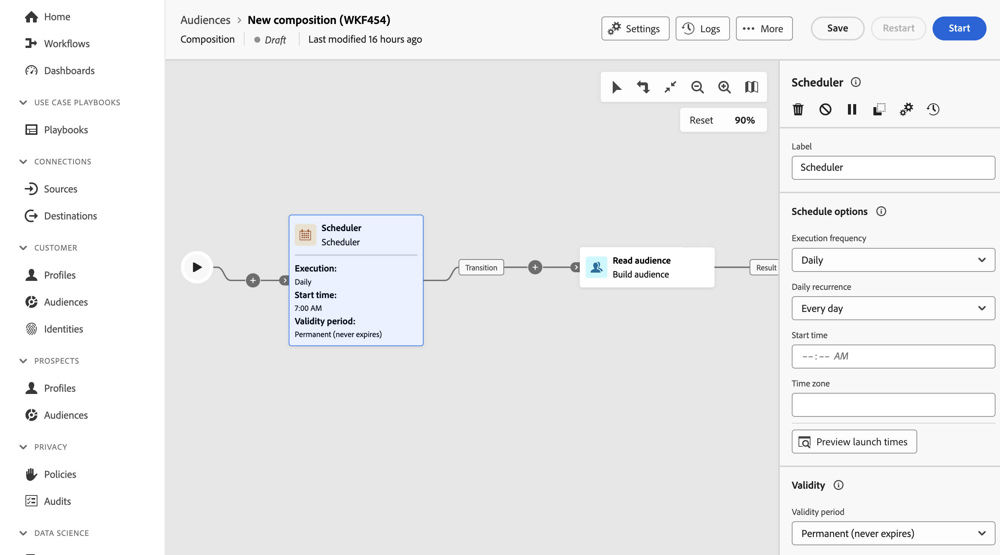

# Planner {#scheduler}

>[!CONTEXTUALHELP]
>id="dc_orchestration_scheduler"
>title="Planningsactiviteit"
>abstract="De **Planner** activiteit staat u toe om te plannen wanneer de publiekssamenstelling begonnen wordt. Deze activiteit moet worden beschouwd als een geplande start. Het kan slechts als eerste activiteit van een samenstelling worden gebruikt."

De **planner** activiteit is de controle **activiteit van de a** Stroom. Het staat u toe om te plannen wanneer de samenstelling wordt begonnen. Deze activiteit moet worden beschouwd als een geplande start. Het kan slechts als eerste activiteit van de samenstelling worden gebruikt.

Als u een verbinding aan de Federated bestemming van de Samenstelling van Gegevens hebt gevormd, kunt u deze activiteit gebruiken om over het publiek van Adobe Experience Platform bij regelmatige frequenties te verzenden. [ Leer hoe te om het publiek van Adobe Experience Platform met externe gegevens te verrijken ](../../connections/destinations.md)

## De planningsactiviteit configureren {#scheduler-configuration}

>[!CONTEXTUALHELP]
>id="dc_orchestration_schedule_validity"
>title="Geldigheid van planner"
>abstract="U kunt een geldigheidsperiode voor de planner bepalen. Deze kan permanent zijn (standaard) of geldig zijn tot een bepaalde datum."

>[!CONTEXTUALHELP]
>id="dc_orchestration_schedule_options"
>title="Planningsopties"
>abstract="Bepaal de frequentie van de planner. Het kan op een specifiek moment, één keer of verscheidene keren per dag, week of maand worden uitgevoerd."

Volg deze stappen om de **Planner** activiteit te vormen:

1. Voeg a **Planner** activiteit aan uw samenstelling toe.

1. Vorm de **frequentie van de Uitvoering**:

   * **Eenmaal**: de samenstelling wordt uitgevoerd één keer.
   * **Dagelijks**: de samenstelling wordt uitgevoerd op een specifieke tijd, eens per dag.
   * **verscheidene tijden per dag:** de samenstelling wordt regelmatig uitgevoerd verscheidene keren per dag. U kunt uitvoeringen instellen op specifieke tijdstippen of periodiek.

     >[!NOTE]
     >
     >Plan geen samenstelling om meer dan om de 15 minuten in werking te stellen aangezien het algemene systeemprestaties kan belemmeren en tot blokken in het gegevensbestand kan leiden.

   * **Wekelijks**: de samenstelling wordt uitgevoerd op een gespecificeerd moment, eens of verscheidene tijden per week.
   * **Maandelijks**: de samenstelling wordt uitgevoerd op een gespecificeerd moment, eens of verscheidene tijden per maand. U kunt maanden selecteren wanneer u de compositie nodig hebt die moet worden uitgevoerd. U kunt uitvoeringen ook instellen op bepaalde weekdagen van de maand, zoals de tweede dinsdag van de maand.

1. Definieer de details van de uitvoering op basis van de geselecteerde frequentie. De detailvelden variëren, afhankelijk van de gebruikte frequentie (tijd, herhalingsfrequentie, opgegeven dagen, enz.).

1. Klik **de lanceringstijden van de Voorproef** om het programma van volgende tien uitvoeringen van uw samenstelling te controleren.

1. Bepaal de geldigheidsperiode van de planner:

   * **Vaste (verloopt nooit)**: de samenstelling wordt uitgevoerd, volgens de gespecificeerde frequentie, zonder enige grenzen aan het tijdkader of aantal herhalingen.

   * **Geldigheidsperiode**: de samenstelling wordt uitgevoerd volgens de gespecificeerde frequentie, tot een specifieke datum. U moet begin- en einddatums opgeven.

>[!NOTE]
>
>Als u de samenstelling wilt onmiddellijk beginnen, kunt u **klikken voert hangende taak** in de hoogste actiebar van de planner uit. Deze knoop is slechts beschikbaar wanneer u de samenstelling bent begonnen.

<!--## Example{#scheduler-example}

In the following example, the activity is configured so that the composition runs several times a day at 9 and 12 AM, every day of the week from October 1st, 2023 to January 1st, 2024.-->
