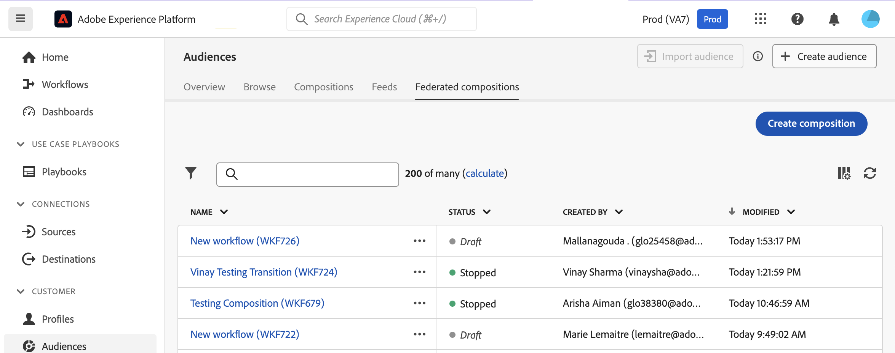

# De compositie maken en configureren {#create}

De eerste stap om een samenstelling tot stand te brengen moet zijn etiket bepalen en extra montages vormen indien nodig.

## De compositie maken {#create-the-composition}

1. Open het menu **[!UICONTROL Audiences]** en selecteer de tab **[!UICONTROL Federated compositions]** .

1. Klik op de knop **[!UICONTROL Create composition]**.

   

1. Geef in de sectie **[!UICONTROL Properties]** een label voor uw compositie op en selecteer een gegevensmodel. Alleen de schema&#39;s die aan dit gegevensmodel zijn gekoppeld, zijn beschikbaar in de activiteiten van uw compositie.

   

1. Klik op **[!UICONTROL Create]**. Het compositicanvas wordt weergegeven. U kunt nu uw compositie configureren door zoveel activiteiten toe te voegen als nodig zijn om aan uw behoeften te voldoen voordat u deze uitvoert:

   * [Leer hoe je activiteiten orkestreert](#action-activities)
   * [ leer hoe te om een samenstelling te beginnen en te controleren ](#save)

## Vorm de montages van de samenstelling {#settings}

>[!CONTEXTUALHELP]
>id="dc_composition_settings_properties"
>title="Compositie-eigenschappen"
>abstract="Deze sectie verstrekt generische samenstellingseigenschappen die ook toegankelijk zijn wanneer het creëren van de samenstelling."

>[!CONTEXTUALHELP]
>id="dc_composition_settings_segmentation"
>title="Compositiesegmentatie"
>abstract="Standaard worden alleen de werktabellen van de laatste uitvoering van de compositie bewaard. U kunt deze optie inschakelen om werktabellen te behouden voor testdoeleinden. Het moet **slechts** op ontwikkeling of het opvoeren milieu&#39;s worden gebruikt. Het mag nooit worden gecontroleerd in een productieomgeving."

>[!CONTEXTUALHELP]
>id="dc_composition_settings_error"
>title="Instellingen voor foutbeheer"
>abstract="In deze sectie kunt u definiëren hoe u fouten tijdens de uitvoering kunt beheren. U kunt ervoor kiezen om het proces te pauzeren, een bepaald aantal fouten te negeren of de compositie-uitvoering te stoppen."

Wanneer het toegang hebben tot van een samenstelling, kunt u tot geavanceerde montages toegang hebben die u, bijvoorbeeld, toestaan om te bepalen hoe de samenstelling zich in het geval van fout zou moeten gedragen. Voor toegang tot deze extra opties klikt u op de knop **[!UICONTROL Settings]** in de bovenste sectie van het scherm voor het maken van composities.

De beschikbare instellingen zijn als volgt:

* **[!UICONTROL Label]**: wijzig het label van de compositie.

* **[!UICONTROL Keep the result of interim populations between two executions]**: Door gebrek, slechts worden de het werk lijsten van de laatste uitvoering van de samenstelling gehouden. De werktabellen van vorige uitvoeringen worden leeggemaakt door een technische samenstelling, die op een dagbasis loopt.

  Als deze optie is ingeschakeld, worden werktabellen behouden, zelfs nadat de compositie is uitgevoerd. U kunt het voor het testen doeleinden gebruiken en daarom moet **slechts** op ontwikkeling of het opvoeren milieu&#39;s worden gebruikt. Het mag nooit worden gecontroleerd in een productiesamenstelling.

* **[!UICONTROL Error management]**: Met deze optie kunt u de handelingen definiëren die moeten worden uitgevoerd als een compositieactiviteit fouten bevat. Er zijn drie mogelijke opties:

   * **[!UICONTROL Suspend the process]**: De compositie wordt automatisch gepauzeerd en de status verandert in **[!UICONTROL Failed]** . Zodra het probleem is opgelost, hervat u de compositie met de **[!UICONTROL Resume]** -knoppen.
   * **[!UICONTROL Ignore]**: De status van de taak die de fout heeft veroorzaakt, verandert in **[!UICONTROL Failed]** , maar de compositie behoudt de status **[!UICONTROL Started]** .
   * **[!UICONTROL Abort the process]**: De compositie wordt automatisch gestopt en de status wordt gewijzigd in **[!UICONTROL Failed]** . Zodra de kwestie wordt opgelost, begin de samenstelling opnieuw gebruikend de **[!UICONTROL Start]** knoop.

* **[!UICONTROL Consecutive errors]**: geef op hoeveel fouten kunnen worden genegeerd voordat het proces wordt gestopt. Zodra dit aantal wordt bereikt, verandert de samenstellingsstatus in **[!UICONTROL Failed]**. Als de waarde van dit veld 0 is, wordt de compositie nooit gestopt, ongeacht het aantal fouten.
