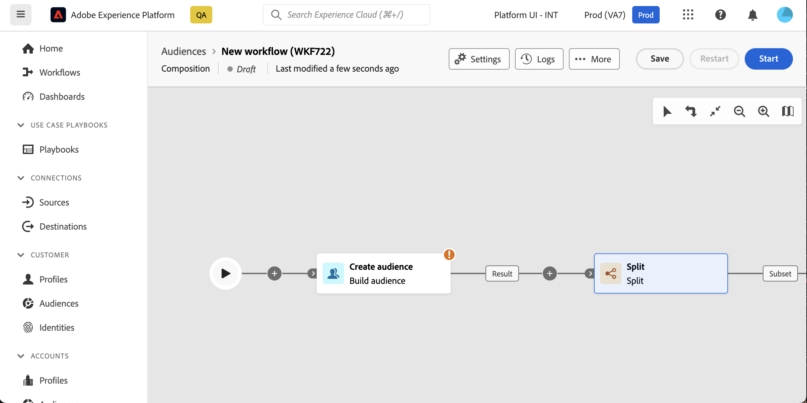

# Aan de slag met composities {#compositions}

## Wat is een samenstelling? {#what}

Met gegevenscompositie voor Adobe kunt u composities maken, waarbij u verschillende activiteiten (splitsen, uitsluiten...) kunt gebruiken in een visueel canvas om een publiek te maken. Als dit eenmaal is gedaan, worden de resulterende doelgroepen samen met het bestaande publiek opgeslagen in Adobe Experience Platform en kunnen ze worden benut in bestemmingen als Journey Optimizer om klanten als doel in te stellen.

## Toegang tot composities {#access}

>[!CONTEXTUALHELP]
>id="dc_workflow_list"
>title="Composities"
>abstract="In dit scherm, kunt u tot de volledige lijst van samenstellingen toegang hebben, hun huidige status, laatste/volgende uitvoeringsdata controleren, en een nieuwe samenstelling creëren."

Composities zijn toegankelijk vanuit de Adobe Experience Platform **[!UICONTROL Audiences]** in het menu **Federale composities** tab.

Vanuit dit scherm kunt u nieuwe composities maken en bestaande composities openen.

Als u de lijst wilt verfijnen en eenvoudig de gewenste compositie wilt zoeken, kunt u de lijst doorzoeken en composities filteren op basis van de status of de laatste verwerkingsdatum.

U kunt de lijst ook aanpassen door kolommen toe te voegen of te verwijderen. Om dit te doen, klik **Kolom configureren** en voegt u de gewenste uitvoerkolommen toe of verwijdert u deze.

Als u een bestaande compositie wilt dupliceren of verwijderen, klikt u op de knop met de ellips naast de naam en selecteert u de gewenste bewerking.

## Status van samenstellingen {#status}

Composities kunnen meerdere statussen hebben:

* **[!UICONTROL Draft]**: De compositie is gemaakt en opgeslagen.
* **[!UICONTROL In progress]**: De compositie is uitgevoerd en wordt momenteel uitgevoerd.
* **[!UICONTROL Stopped]**: De uitvoering van de compositie is gestopt.
* **[!UICONTROL Paused]**: De uitvoering van de compositie is gepauzeerd.
* **[!UICONTROL Erroneous]**: Er is een fout opgetreden tijdens het uitvoeren van de compositie. Open de compositie en open de logboeken en de taken om de fout te identificeren en op te lossen.
