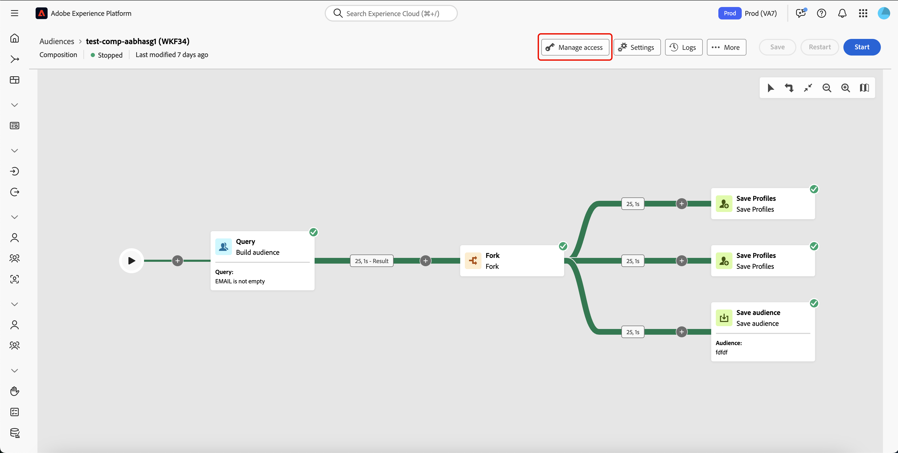

# Aan de slag met composities {#compositions}

>[!AVAILABILITY]
>
>Voor toegang tot composities hebt u een van de volgende machtigingen nodig:
>
>- **beheer Federale Samenstellingen**
>&#x200B;>- **Mening Federatieve Samenstellingen**
>
>Voor meer informatie over de vereiste toestemmingen, te lezen gelieve de [ gids van de toegangscontrole ](/help/governance-privacy-security/access-control.md).

Met Federatieve compositie voor publiek kunt u composities maken, waarbij u verschillende activiteiten kunt gebruiken in een visueel canvas om een publiek te maken. Nadat u de compositie hebt gemaakt, worden de resulterende doelgroepen opgeslagen in Adobe Experience Platform en kunnen ze worden gebruikt in Experience Platform-bestemmingen en Adobe Journey Optimizer om klanten als doel in te stellen.

{zoomable="yes"}{width="70%"}

## Composities openen en beheren {#access}

>[!CONTEXTUALHELP]
>id="dc_composition_list"
>title="Composities"
>abstract="In dit scherm, kunt u tot de volledige lijst van samenstellingen toegang hebben, hun huidige status, laatste/volgende uitvoeringsdata controleren, en een nieuwe samenstelling creëren."

Composities zijn toegankelijk via het menu Adobe Experience Platform **[!UICONTROL Audiences]** op het tabblad **[!UICONTROL Federated compositions]** in de sectie **[!UICONTROL Customers]** .

Vanuit dit scherm kunt u nieuwe composities maken en bestaande composities openen. U kunt een bestaande samenstelling ook dupliceren of schrappen door de  knoop naast zijn naam te selecteren.

U kunt ook informatie weergeven over de composities, zoals de naam, de status, de maker en de datum die als laatste is gewijzigd.

| Status | Beschrijving |
| ------ | ----------- |
| **[!UICONTROL Draft]** | De compositie is gemaakt en opgeslagen. |
| **[!UICONTROL In progress]** | De compositie is uitgevoerd en wordt momenteel uitgevoerd. |
| **[!UICONTROL Stopped]** | De uitvoering van de compositie is voltooid en is gestopt. |
| **[!UICONTROL Paused]** | De uitvoering van de compositie is gepauzeerd. |
| **[!UICONTROL Erroneous]** | Er is een fout opgetreden tijdens het uitvoeren van de compositie. Voor meer informatie over de fout opent u de compositie en opent u de logbestanden. |

U kunt leren hoe te om een samenstelling in het [ begin te beginnen of tegen te houden en samenstellingsgids ](./start-monitor-composition.md) te controleren.

{zoomable="yes"}{width="70%"}

Als u de lijst wilt verfijnen en de compositie wilt zoeken die u zoekt, kunt u de lijst doorzoeken en composities filteren op basis van de status of de laatste verwerkingsdatum.

U kunt de lijst ook aanpassen door kolommen toe te voegen of te verwijderen. Selecteer hiertoe de knop **[!UICONTROL Configure columns]** en voeg de gewenste uitvoerkolommen toe of verwijder deze.

{zoomable="yes"}{width="70%"}

### Toegangslabels toepassen {#access-labels}

Om toegangslabels op een specifieke samenstelling toe te passen, selecteer de samenstelling, die door **[!UICONTROL Manage access]** wordt gevolgd.

{zoomable="yes"}{width="70%"}

De pop-up **[!UICONTROL Manage access]** wordt weergegeven. Op deze pagina, kunt u de toepasselijke toegang en de etiketten van het gegevensbeheer op uw samenstelling toepassen.

{zoomable="yes"}{width="70%"}

| Type label | Beschrijving |
| ---------- | ----------- |
| Contractlabels | De etiketten van het contract (&quot;C&quot;etiketten) worden gebruikt om gegevens te categoriseren die contractuele verplichtingen hebben of met het beleid van het gegevensbeheer van uw organisatie verwant zijn. |
| Identiteitslabels | De etiketten van de identiteit (&quot;I&quot;etiketten) worden gebruikt om gegevens te categoriseren die een specifieke persoon kunnen identificeren of contacteren. |
| Gevoelige labels | Gevoelige labels (&quot;S&quot;-labels) worden gebruikt om u te categoriseren en/of om te bepalen of uw organisatie gevoelig is. |
| Partnerecosysteemlabels | De etiketten van het Ecosysteem van de partner worden gebruikt om gegevens uit bronnen buiten uw organisatie te categoriseren. |

Voor meer informatie over toegang en de etiketten van het gegevensbeheer, te lezen gelieve de [ verklarende woordenlijst van het het etiketetiket van het gegevensgebruik ](https://experienceleague.adobe.com/nl/docs/experience-platform/data-governance/labels/reference).

## Volgende stappen

Na het lezen van deze gids, hebt u geleerd om, tot toegangslabels voor uw samenstellingen toegang te hebben te leiden en te leiden. Voor meer informatie bij het werken met publiek als geheel, gelieve te lezen de [ gids van het publiek ](../start/audiences.md).
