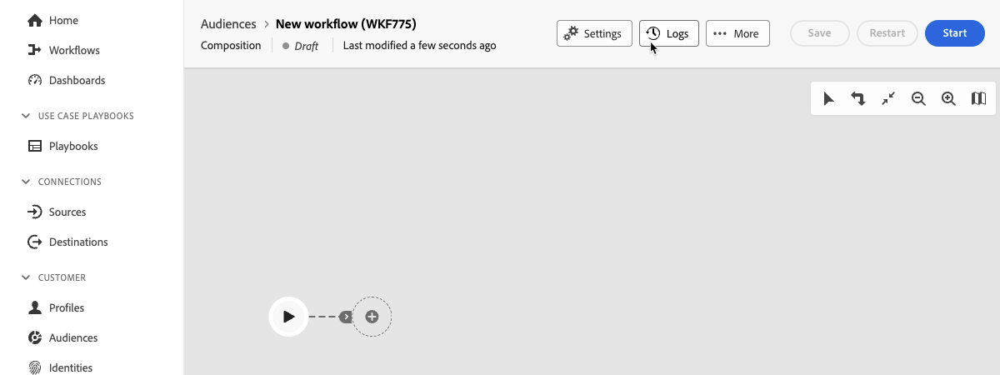

# Uw compositie starten en controleren {#start-monitor}

Nadat u de compositie hebt gemaakt en de taken hebt ontworpen die u op het canvas wilt uitvoeren, kunt u deze starten en controleren hoe deze wordt uitgevoerd.

## De compositie starten {#start}

Als u een compositie wilt starten, klikt u op de knop **[!UICONTROL Start]** in de rechterbovenhoek van het scherm. Wanneer de samenstelling loopt, wordt elke activiteit in het canvas uitgevoerd in een opeenvolgende orde, tot het eind van de samenstelling wordt bereikt.

U kunt de voortgang van doelprofielen in real time volgen gebruikend een visuele stroom. Hierdoor kunt u snel de status van elke activiteit en het aantal profielen identificeren dat tussen de activiteiten overgaat.

## Compositieovergangen {#transitions}

In samenstellingen worden gegevens die van de ene activiteit naar de andere worden vervoerd via overgangen opgeslagen in een tijdelijke werktabel. Deze gegevens kunnen voor elke overgang worden weergegeven. Selecteer hiertoe een overgang om de eigenschappen ervan in de rechterkant van het scherm te openen.

* Klik op **[!UICONTROL Preview schema]** om het schema van de werktabel weer te geven.
* Klik op **[!UICONTROL Preview results]** om de gegevens te visualiseren die in de geselecteerde overgang worden verzonden.

## Activiteitenuitvoering controleren {#activities}

De visuele indicatoren in de hoger-juiste hoek van elke activiteitendoos staan u toe om hun uitvoering te controleren:

| Visuele indicator | Beschrijving |
|-----|------------|
| {zoomable="yes"}{width="70%"} | De activiteit wordt momenteel uitgevoerd. |
| {zoomable="yes"}{width="70%"} | De activiteit vereist uw aandacht. Dit kan inhouden dat de verzending van een levering wordt bevestigd of dat de nodige actie wordt ondernomen. |
| {zoomable="yes"}{width="70%"} | Er is een fout opgetreden in de activiteit. Om de kwestie op te lossen, open samenstellingslogboeken voor meer informatie. |
| {zoomable="yes"}{width="70%"} | De activiteit is met succes uitgevoerd. |

## Logboeken en taken controleren {#logs-tasks}

Het controleren van samenstellingenlogboeken en taken is een zeer belangrijke stap om uw samenstellingen te analyseren en ervoor te zorgen zij behoorlijk lopen. Ze zijn toegankelijk via de knop **[!UICONTROL Logs]** die beschikbaar is in de werkbalk Handeling en in het deelvenster Eigenschappen van elke activiteit.

Het scherm **[!UICONTROL Composition logs and tasks]** biedt een geschiedenis van de uitvoering van de compositie, waarbij alle handelingen van de gebruiker worden opgenomen en fouten worden aangetroffen.

<!-- à confirmer, pas trouvé dans les options = The workflow history is saved for the duration specified in the workflow execution options. During this duration, all the messages are therefore saved, even after a restart. If you do not want to save the messages from a previous execution, you have to purge the history by clicking the  button.-->

De historie wordt ingedeeld in verschillende tabbladen, die hieronder worden beschreven:

* Het tabblad **[!UICONTROL Log]** bevat de uitvoeringsgeschiedenis van alle compositieactiviteiten. De uitgevoerde bewerkingen en uitvoeringsfouten worden chronologisch geïndexeerd.
* Het tabblad **[!UICONTROL Tasks]** bevat details over de uitvoeringsvolgorde van de activiteiten. Met de knop aan het einde van elke taak kunt u de gebeurtenisvariabelen weergeven die door de activiteit worden doorgegeven.
* Het tabblad **[!UICONTROL Variables]** bevat een lijst met alle variabelen die in de compositie worden doorgegeven. Het is beschikbaar wanneer het toegang tot van de logboeken en de taken van het samenstellingscanvas slechts. Het is nu beschikbaar wanneer u de logboeken opent vanuit het deelvenster met eigenschappen van een activiteit.  <!-- à confirmer-->

Op alle tabbladen kunt u de weergegeven kolommen en hun volgorde kiezen, filters toepassen en het zoekveld gebruiken om snel de gewenste informatie te zoeken.

## Opdrachten voor het uitvoeren van composities {#execution-commands}

De actiebalk in de rechterbovenhoek biedt opdrachten waarmee u de uitvoering van de compositie kunt beheren.

Beschikbare acties zijn:

* **Begin**: Begint de uitvoering van de samenstelling, die dan de **neemt Bezig** status. De samenstelling is begonnen en de eerste activiteiten worden geactiveerd.

* **[!UICONTROL Resume]**: hiermee hervat u de uitvoering van de compositie die was gepauzeerd. De samenstelling neemt **Bezig** status over.

* **[!UICONTROL Pause]** de uitvoering van de samenstelling, die dan de **Gepauzeerde** status neemt. Er zullen geen nieuwe activiteiten worden geactiveerd totdat de activiteiten worden hervat, maar de lopende activiteiten worden niet opgeschort.

* **[!UICONTROL Stop]** een samenstelling die wordt uitgevoerd, die dan de **Voltooide** status zal nemen. De lopende bewerkingen worden indien mogelijk onderbroken. U kunt de compositie niet hervatten vanaf dezelfde plaats als waar deze is gestopt.

* **Begin** opnieuw: Stopt dan opnieuw een samenstelling. In de meeste gevallen, staat dit u toe om sneller opnieuw te beginnen, aangezien het tegenhouden een bepaalde hoeveelheid tijd vergt, en de **knoop van het Begin** is slechts beschikbaar wanneer het einde effectief is.
