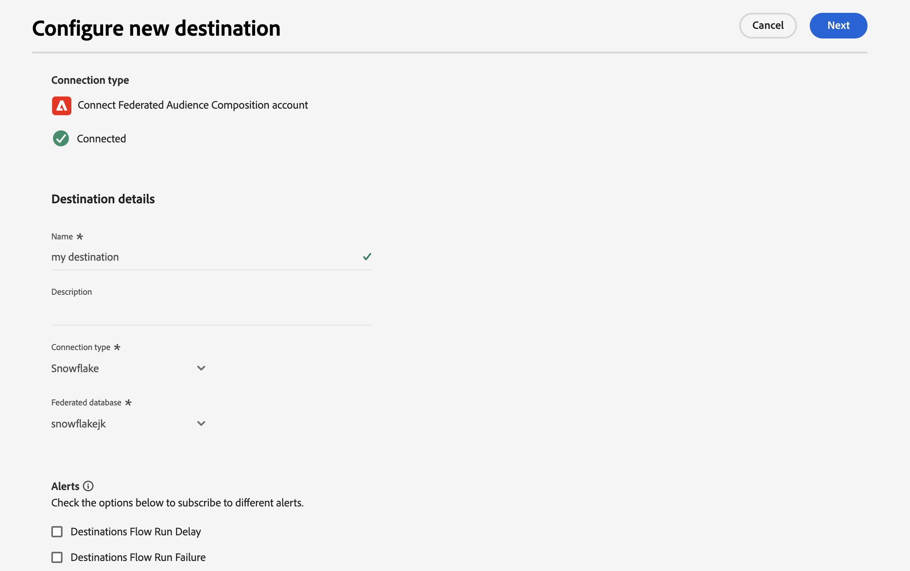

# Het Adobe Experience Platform-publiek verrijken met externe gegevens {#connect-aep-fac}

>[!CONTEXTUALHELP]
>id="dc_new_destination"
>title="Een doel maken"
>abstract="Ga de montages in om met het nieuwe Federated gegevensbestand te verbinden. Gebruik de knop **[!UICONTROL Connect to destination]** om uw configuratie te valideren."

Adobe Experience Platform staat naadloze integratie van publiek van het Portaal van het Publiek met uw externe gegevensbestanden toe gebruikend de **Adobe Federated bestemming van de Samenstelling van het Publiek**. Met deze integratie kunt u bestaande doelgroepen gebruiken voor composities en ze verrijken of verfijnen met gegevens uit uw externe databases om nieuwe doelgroepen te maken.

Hiertoe moet u in Adobe Experience Platform een nieuwe verbinding maken met de Adobe Federated Audience Composition-bestemming. U kunt een planner gebruiken om een bepaald publiek bij regelmatige frequenties te verzenden, specifieke te omvatten attributen, zoals IDs voor gegevensverzoening selecteren. Als u het beheer- en privacybeleid hebt toegepast op uw publiek, worden deze gegevens bewaard en teruggestuurd naar de portal voor het publiek nadat het publiek is bijgewerkt.

Bijvoorbeeld, laten wij zeggen u koopinformatie in uw gegevenspakhuis opslaat en een publiek van Adobe Experience Platform heeft gericht op klanten die in de laatste twee maanden in een specifiek product geïnteresseerd zijn. Gebruikend de Federatieve bestemming van de Samenstelling van de Publiek, kunt u:

* Verfijn het publiek op basis van aankoopgegevens. U kunt het publiek bijvoorbeeld filteren op klanten die alleen een aankoop van meer dan 150$ hebben gedaan.
* Vergroot het publiek met velden die betrekking hebben op aankopen, zoals de productnaam en het aangekochte aantal.

De belangrijkste stappen om Adobe Experience Platform-publiek naar Adobe Federated Audience Composition te sturen zijn als volgt:

1. Open de catalogus van de Doelen van Adobe Experience Platform en selecteer de Federatieve bestemming van de Samenstelling van het Publiek.

   Selecteer **[!UICONTROL Configure new destination]** in het rechterdeelvenster.

   

1. Voer een naam in voor de nieuwe verbinding en selecteer de **[!UICONTROL Connection Type]** van de volgende beschikbare verbindingen:

   * Amazon Redshift
   * Azure Synapse Analytics
   * Google Big Query
   * Snowflake
   * Vertica Analytics
   * Databricks
   * Microsoft Fabric

1. Selecteer **[!UICONTROL Federated database]** waarmee u verbinding wilt maken en klik op **[!UICONTROL Next]** .

   

1. In de sectie **[!UICONTROL Alerts]** kunt u waarschuwingen inschakelen voor het ontvangen van meldingen over de status van de gegevensstroom naar uw bestemming.

   Voor meer informatie over alarm, zie de documentatie van Adobe Experience Platform over [ het intekenen aan bestemmingsalarm gebruikend UI ](https://experienceleague.adobe.com/en/docs/experience-platform/destinations/ui/alerts){target="_blank"} 

1. In de stap **[!UICONTROL Governance policy & enforcement actions]** kunt u het beleid voor gegevensbeheer definiëren en ervoor zorgen dat de gebruikte gegevens voldoen wanneer een publiek wordt verstuurd en geactiveerd.

   Wanneer u klaar bent met het selecteren van de gewenste marketingacties voor het doel, klikt u op **[!UICONTROL Create]** .

1. De nieuwe verbinding met het doel wordt gemaakt. U kunt het publiek nu activeren om naar de bestemming te gaan. U doet dit door het in de lijst te selecteren en op **[!UICONTROL Next]** te klikken

   

1. Selecteer het gewenste publiek dat u wilt verzenden.

1. Selecteer het pictogram  om uw exportschema te bewerken.

   

1. Definieer de exportopties voor het bestand. Als u het publiek sneller wilt activeren, selecteert u de optie **[!UICONTROL After segment evaluation]** om de activeringstaak te activeren direct nadat de dagelijkse batchsegmentatietaak Platform is voltooid.

   

   >[!NOTE]
   >
   >De gedetailleerde informatie over hoe te om programma en filenames te vormen is beschikbaar in de volgende secties van de documentatie van Adobe Experience Platform:
   >
   >* [ de publieksuitvoer van het Programma ](https://experienceleague.adobe.com/en/docs/experience-platform/destinations/ui/activate/activate-batch-profile-destinations#scheduling){target="_blank"} 
   >* [ vorm dossiernamen ](https://experienceleague.adobe.com/en/docs/experience-platform/destinations/ui/activate/activate-batch-profile-destinations#configure-file-names){target="_blank"} 

1. Selecteer in de stap **[!UICONTROL Mapping]** welke kenmerk- en identiteitsvelden u wilt exporteren voor uw publiek of doelgroepen. Voor meer informatie, bekijk de [ toewijzingsstap ](https://experienceleague.adobe.com/en/docs/experience-platform/destinations/ui/activate/activate-batch-profile-destinations#mapping){target="_blank"}  in de documentatie van Adobe Experience Platform.

   

1. Controleer de doelconfiguratie en de publieksinstellingen en klik vervolgens op **[!UICONTROL Finish]** .

   

Het geselecteerde publiek wordt nu geactiveerd voor de nieuwe verbinding. U kunt meer soorten publiek toevoegen om met deze verbinding te verzenden door terug naar de **[!UICONTROL Activate audiences]** pagina te navigeren. U kunt soorten publiek niet verwijderen als ze eenmaal zijn geactiveerd.
