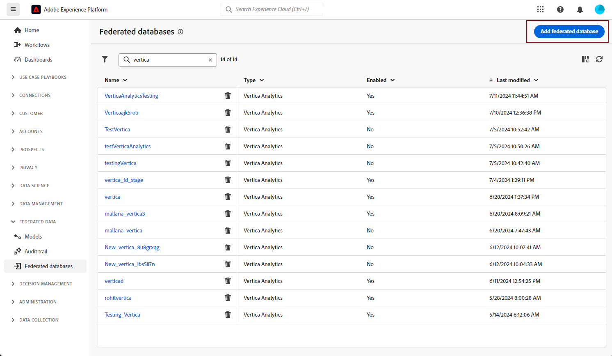
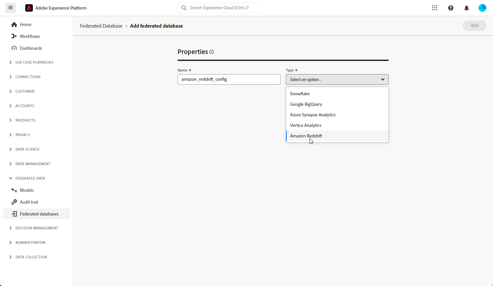

# Vorm uw Federale gegevensbestanden {#federated-db}

>[!CONTEXTUALHELP]
>id="dc_connection_federated_database_menu"
>title="Federale databases"
>abstract="Bestaande verbindingen met gefederaliseerde databases worden in dit scherm weergegeven. Klik op de knop **[!UICONTROL Add federated database]** om een nieuwe verbinding te maken."

>[!CONTEXTUALHELP]
>id="dc_connection_federated_database_properties"
>title="Federale database-eigenschappen"
>abstract="Ga de naam van het nieuwe Federated gegevensbestand in, en selecteer zijn type."

>[!CONTEXTUALHELP]
>id="dc_connection_federated_database_details"
>title="Gegevens van gefederaliseerde database"
>abstract="Ga de montages in om met het nieuwe Federated gegevensbestand te verbinden. Gebruik de knop **[!UICONTROL Test connection]** om uw configuratie te valideren."

Met Experience Platform Federated Audience Composition kan de Klant een publiek opbouwen en verrijken vanuit de gegevensopslagruimten van derden en het publiek naar Adobe Experience Platform importeren.

Leer hoe te om, de verbinding aan uw extern gegevensbestand in [ te creëren te vormen, te testen en te bewaren deze pagina ](connections.md). U vindt onder de lijst met ondersteunde databases en de gedetailleerde instellingen die voor elk van deze databases moeten worden geconfigureerd.

## Ondersteunde databases {#supported-db}

Met Federated Audience Composition kunt u verbinding maken met de volgende databases. De configuratie voor elke database wordt hieronder beschreven.

* [Amazon Redshift](#amazon-redshift)
* [Azure synapse Analytics](#azure-synapse)
* [Google Big Query](#google-big-query)
* [Snowflake](#snowflake)
* [Vertica Analytics](#vertica-analytics)

## Amazon Redshift {#amazon-redshift}

Gebruik gefederaliseerde databases om informatie te verwerken die in een externe database is opgeslagen. Voer de onderstaande stappen uit om toegang tot Amazon Redshift te configureren.

1. Selecteer **[!UICONTROL Federated databases]** onder het menu **[!UICONTROL Federated data]** .

1. Klik op **[!UICONTROL Add federated database]**.

   

1. Voer een **[!UICONTROL Name]** in voor uw Federale database.

1. Selecteer Amazon Opnieuw verschuiven in de vervolgkeuzelijst **[!UICONTROL Type]** .

   

1. Configureer de Amazon Redshift-verificatie-instellingen:

   * **[!UICONTROL Server]**: voeg de naam van DNS toe.

   * **[!UICONTROL Account]**: voeg de gebruikersnaam toe.

   * **[!UICONTROL Password]**: voeg het accountwachtwoord toe.

   * **[!UICONTROL Database]**: naam van de database indien niet opgegeven in DSN. Deze kan leeg worden gelaten, indien opgegeven in de DSN

   * **[!UICONTROL Working schema]**: naam van het databaseschema dat moet worden gebruikt voor werktabellen. Leer meer in [ documentatie van Amazon ](https://docs.aws.amazon.com/redshift/latest/dg/r_Schemas_and_tables.html) {target="_blank"}

     >[!NOTE]
     >
     >U kunt om het even welk schema van het gegevensbestand, met inbegrip van schema&#39;s gebruiken die voor tijdelijke gegevensverwerking worden gebruikt, zolang u de vereiste toestemming hebt om met dit schema te verbinden.
     >
     >**afzonderlijke werkende schema&#39;s** moeten worden gebruikt wanneer het verbinden van veelvoudige zandbakken met het zelfde gegevensbestand.

1. Selecteer de optie **[!UICONTROL Test the connection]** om uw configuratie te verifiëren.

1. Klik op de knop **[!UICONTROL Deploy functions]** om de functies te maken.

1. Zodra uw configuratie wordt gedaan, klik **[!UICONTROL Add]** om uw Federale gegevensbestand tot stand te brengen.

## Azure synapse Analytics {#azure-synapse}

Gebruik gefederaliseerde databases om informatie te verwerken die in een externe database is opgeslagen. Voer de onderstaande stappen uit om toegang tot Azure synapse Analytics te configureren.

1. Selecteer **[!UICONTROL Federated databases]** onder het menu **[!UICONTROL Federated data]** .

1. Klik op **[!UICONTROL Add federated database]**.

   

1. Voer een **[!UICONTROL Name]** in voor uw Federale database.

1. Selecteer in de vervolgkeuzelijst **[!UICONTROL Type]** de optie Azure synapse Analytics.

   

1. Configureer de verificatie-instellingen voor Azure synapse Analytics:

   * **[!UICONTROL Server]**: voer de URL van de Azure synapse server in.

   * **[!UICONTROL Account]**: voer de gebruikersnaam in.

   * **[!UICONTROL Password]**: voer het accountwachtwoord in.

   * **[!UICONTROL Database]** (optioneel): voer de naam van de database in als deze niet in de DSN is opgegeven.

   * **[!UICONTROL Options]**: De connector ondersteunt de opties die in de onderstaande tabel worden beschreven.

1. Selecteer de optie **[!UICONTROL Test the connection]** om uw configuratie te verifiëren.

1. Klik op de knop **[!UICONTROL Deploy functions]** om de functies te maken.

1. Zodra uw configuratie wordt gedaan, klik **[!UICONTROL Add]** om uw Federale gegevensbestand tot stand te brengen.

| Optie | Beschrijving |
|---|---|
| Verificatie | Type van authentificatie die door de schakelaar wordt gesteund. Huidige ondersteunde waarde: ActiveDirectoryMSI. Voor meer informatie, verwijs naar [ SQL documentatie van Microsoft ](https://learn.microsoft.com/en-us/sql/connect/odbc/using-azure-active-directory?view=sql-server-ver15#example-connection-strings) {target="_blank"} (de verbindingskoorden van het Voorbeeld n°8) |

## Google Big Query {#google-big-query}

Gebruik gefederaliseerde databases om informatie te verwerken die in een externe database is opgeslagen. Voer de onderstaande stappen uit om toegang tot Google Big Query te configureren.

1. Selecteer **[!UICONTROL Federated databases]** onder het menu **[!UICONTROL Federated data]** .

1. Klik op **[!UICONTROL Add federated database]**.

   

1. Voer een **[!UICONTROL Name]** in voor uw Federale database.

1. Selecteer Google Big Query in de vervolgkeuzelijst **[!UICONTROL Type]** .

   

1. Configureer de Google Big Query-verificatie-instellingen:

   * **[!UICONTROL Service account]**: voer de e-mail van uw **[!UICONTROL Service account]** in. Voor meer informatie over dit, verwijs naar [ de documentatie van de Wolk van Google ](https://cloud.google.com/iam/docs/creating-managing-service-accounts) {target="_blank"}.

   * **[!UICONTROL Project]**: voer de id van de **[!UICONTROL Project]** in. Voor meer informatie over dit, verwijs naar [ de documentatie van de Wolk van Google ](https://cloud.google.com/resource-manager/docs/creating-managing-projects) {target="_blank"}.

   * **[!UICONTROL Dataset]**: voer de naam van de **[!UICONTROL Dataset]** in. Voor meer informatie over dit, verwijs naar [ de documentatie van de Wolk van Google ](https://cloud.google.com/bigquery/docs/datasets-intro) {target="_blank"}.

   * **[!UICONTROL Key file Path]**: upload het sleutelbestand naar de server. Alleen .json-bestanden worden geaccepteerd.

   * **[!UICONTROL Options]**: De connector ondersteunt de opties die in de onderstaande tabel worden beschreven.

1. Selecteer de optie **[!UICONTROL Test the connection]** om uw configuratie te verifiëren.

1. Klik op de knop **[!UICONTROL Deploy functions]** om de functies te maken.

1. Zodra uw configuratie wordt gedaan, klik **[!UICONTROL Add]** om uw Federale gegevensbestand tot stand te brengen.

| Optie | Beschrijving |
|---|---|
| ProxyType | Het type proxy dat wordt gebruikt om verbinding te maken met BigQuery via ODBC- en SDK-connectors.   HTTP (gebrek), http_no_tunnel, socks4 en socks5 worden momenteel gesteund. |
| ProxyHost | Hostnaam of IP-adres waar de proxy kan worden bereikt. |
| ProxyPort | Poortnummer waarop de proxy wordt uitgevoerd, bijvoorbeeld 8080 |
| ProxyUid | Gebruikersnaam voor de geverifieerde proxy |
| ProxyPwd | Wachtwoord ProxyUid |
| bqpath | Dit is alleen van toepassing voor bulkload (Cloud SDK).   Als u wilt voorkomen dat de PATH-variabele wordt gebruikt of als de Google-cloud-sdk-map naar een andere locatie moet worden verplaatst, kunt u met deze optie het exacte pad naar de SDK-binmap van de cloud op de server opgeven. |
| GCloudConfigName | Dit is alleen van toepassing vanaf versie 7.3.4 en voor bulkload (Cloud SDK).  De Google Cloud SDK gebruikt configuraties om gegevens in BigQuery-tabellen te laden. In de configuratie met de naam `accfda` worden de parameters voor het laden van de gegevens opgeslagen. Met deze optie kunnen gebruikers echter een andere naam voor de configuratie opgeven. |
| GCloudDefaultConfigName | Dit is alleen van toepassing vanaf versie 7.3.4 en voor bulkload (Cloud SDK).  De actieve Google Cloud SDK-configuratie kan niet worden verwijderd zonder de actieve tag eerst over te brengen naar een nieuwe configuratie. Deze tijdelijke configuratie is nodig om de hoofdconfiguratie voor het laden van gegevens opnieuw te maken. De standaardnaam voor de tijdelijke configuratie is `default` . Indien nodig kunt u deze naam wijzigen. |
| GCloudRecreateConfig | Dit is alleen van toepassing vanaf versie 7.3.4 en voor bulkload (Cloud SDK).  Wanneer dit op `false` is ingesteld, probeert het mechanisme voor bulkladen de Google Cloud SDK-configuraties niet opnieuw te maken, te verwijderen of te wijzigen. In plaats daarvan worden gegevens geladen met behulp van de bestaande configuratie op de computer. Deze functie is nuttig wanneer andere bewerkingen afhankelijk zijn van Google Cloud SDK-configuraties.   Als de gebruiker deze motoroptie inschakelt zonder de juiste configuratie, geeft het mechanisme voor het laden van grote hoeveelheden een waarschuwingsbericht weer: `No active configuration found. Please either create it manually or remove the GCloudRecreateConfig option` . Om verdere fouten te voorkomen, zal het dan aan het gebruiken van het standaard ODBC de bulkladingsmechanisme van het Tussenvoegsel van de Serie terugkeren. |

## Snowflake {#snowflake}

Gebruik gefederaliseerde databases om informatie te verwerken die in een externe database is opgeslagen. Voer de onderstaande stappen uit om toegang tot Snowflake te configureren.

1. Selecteer **[!UICONTROL Federated databases]** onder het menu **[!UICONTROL Federated data]** .

1. Klik op **[!UICONTROL Add federated database]**.

   

1. Voer een **[!UICONTROL Name]** in voor uw Federale database.

1. Selecteer Snowflake in de vervolgkeuzelijst **[!UICONTROL Type]** .

   

1. Configureer de instellingen voor Snowflake-verificatie:

   * **[!UICONTROL Server]**: voer uw servernaam in.

   * **[!UICONTROL User]**: voer uw gebruikersnaam in.

   * **[!UICONTROL Password]**: voer het wachtwoord voor uw account in.

   * **[!UICONTROL Database]** (optioneel): voer de naam van de database in als deze niet in de DSN is opgegeven.

   * **[!UICONTROL Working schema]** (optioneel): voer de naam in van het databaseschema dat u wilt gebruiken voor werktabellen.

     >[!NOTE]
     >
     >U kunt om het even welk schema van het gegevensbestand, met inbegrip van schema&#39;s gebruiken die voor tijdelijke gegevensverwerking worden gebruikt, zolang u de vereiste toestemming hebt om met dit schema te verbinden.
     >
     >**afzonderlijke werkende schema&#39;s** moeten worden gebruikt wanneer het verbinden van veelvoudige zandbakken met het zelfde gegevensbestand.

   * **[!UICONTROL Private key]**: klik op het veld **[!UICONTROL Private key]** om de .pem-bestanden in de map met landinstellingen te selecteren.

   * **[!UICONTROL Options]**: De connector ondersteunt de opties die in de onderstaande tabel worden beschreven.

1. Selecteer de optie **[!UICONTROL Test the connection]** om uw configuratie te verifiëren.

1. Klik op de knop **[!UICONTROL Deploy functions]** om de functies te maken.

1. Zodra uw configuratie wordt gedaan, klik **[!UICONTROL Add]** om uw Federale gegevensbestand tot stand te brengen.

De connector ondersteunt de volgende opties:

| Optie | Beschrijving |
|---|---|
| werkschema | Databaseschema dat moet worden gebruikt voor werktabellen |
| entrepot | Naam van het standaardentrepot aan gebruik. De standaardinstelling van de gebruiker wordt hierdoor genegeerd. |
| TimeZoneName | Standaard leeg, wat betekent dat de toepassingenserver van de systeemtijdzone wordt gebruikt. De optie kan worden gebruikt om de TIMEZONE-sessieparameter te forceren.   voor meer op dit, verwijs naar [ deze pagina ](https://docs.snowflake.net/manuals/sql-reference/parameters.html#timezone) {target="_blank"}. |
| WeekStart | WEEK_START, sessieparameter. Standaard ingesteld op 0.   voor meer op dit, verwijs naar [ deze pagina ](https://docs.snowflake.com/en/sql-reference/parameters.html#week-start) {target="_blank"}. |
| UseCachedResult | USE_CACHED_RESULTS sessieparameter. Standaard ingesteld op TRUE. Deze optie kan worden gebruikt om Snowflake caching resultaten onbruikbaar te maken.   voor meer op dit, verwijs naar [ deze pagina ](https://docs.snowflake.net/manuals/user-guide/querying-persisted-results.html) {target="_blank"}. |
| bulkThreads | Het aantal draden dat moet worden gebruikt voor bulksgewijs laden van Snowflaken, meer threads betekenen betere prestaties voor grotere bulkladingen. Standaard ingesteld op 1. Het aantal kan, afhankelijk van het aantal van de machindraad worden aangepast. |
| chunkSize | Hiermee bepaalt u de bestandsgrootte van het segment voor bulksloader. Standaard ingesteld op 128 MB. Kan worden aangepast voor een betere prestatie, wanneer gebruikt met bulkThreads. Meer tegelijkertijd actieve threads betekenen betere prestaties.   voor meer op dit, verwijs naar [ documentatie van de Snowflake ](https://docs.snowflake.net/manuals/sql-reference/sql/put.html) {target="_blank"}. |
| StageName | Naam van het vooraf ingestelde interne werkgebied. Het wordt gebruikt in bulk lading in plaats van het creëren van een nieuwe tijdelijke fase. |

## Vertica Analytics {#vertica-analytics}

Gebruik gefederaliseerde databases om informatie te verwerken die in een externe database is opgeslagen. Voer de onderstaande stappen uit om toegang tot Vertica analytics te configureren.

1. Selecteer **[!UICONTROL Federated databases]** onder het menu **[!UICONTROL Federated data]** .

1. Klik op **[!UICONTROL Add federated database]**.

   

1. Voer een **[!UICONTROL Name]** in voor uw Federale database.

1. Selecteer Vertica analytics in de vervolgkeuzelijst **[!UICONTROL Type]** .

   

1. Configureer de instellingen voor Vertica analytics-verificatie:

   * **[!UICONTROL Server]**: voeg de URL van de [!DNL Vertica Analytics] -server toe.

   * **[!UICONTROL Account]**: voeg de gebruikersnaam toe.

   * **[!UICONTROL Password]**: voeg het accountwachtwoord toe.

   * **[!UICONTROL Database]** (optioneel): voer de naam van de database in als deze niet in de DSN is opgegeven.

   * **[!UICONTROL Working schema]** (optioneel): voer de naam in van het databaseschema dat u wilt gebruiken voor werktabellen.

     >[!NOTE]
     >
     >U kunt om het even welk schema van het gegevensbestand, met inbegrip van schema&#39;s gebruiken die voor tijdelijke gegevensverwerking worden gebruikt, zolang u de vereiste toestemming hebt om met dit schema te verbinden.
     >
     >**afzonderlijke werkende schema&#39;s** moeten worden gebruikt wanneer het verbinden van veelvoudige zandbakken met het zelfde gegevensbestand.

   * **[!UICONTROL Options]**: De connector ondersteunt de opties die in de onderstaande tabel worden beschreven.

1. Selecteer de optie **[!UICONTROL Test the connection]** om uw configuratie te verifiëren.

1. Klik op de knop **[!UICONTROL Deploy functions]** om de functies te maken.

1. Zodra uw configuratie wordt gedaan, klik **[!UICONTROL Add]** om uw Federale gegevensbestand tot stand te brengen.

De connector ondersteunt de volgende opties:

| Optie | Beschrijving |
|---|---|
| TimeZoneName | Standaard leeg, wat betekent dat de systeemtijdzone van de toepassingsserver wordt gebruikt. De optie kan worden gebruikt om de TIMEZONE-sessieparameter te forceren. |
