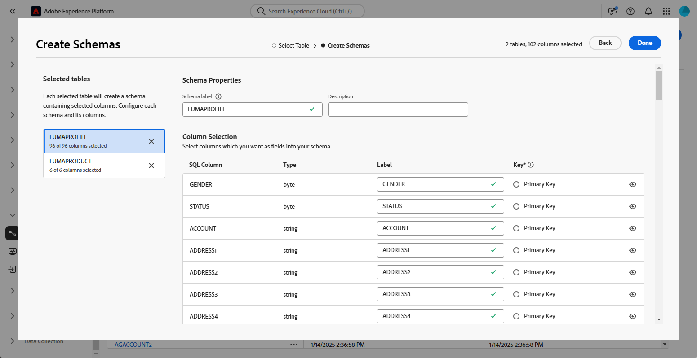
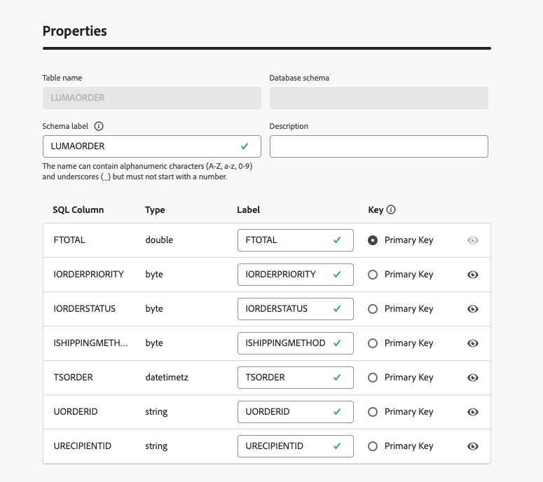

# Aan de slag met schema&#39;s {#schemas}

>[!CONTEXTUALHELP]
>id="dc_schema_create_select_tables"
>title="Tabellen selecteren"
>abstract="Selecteer de tabellen die u wilt toevoegen voor het gegevensmodel."

>[!CONTEXTUALHELP]
>id="dc_schema_create_key"
>title="Sleutel"
>abstract="Selecteer een sleutel voor de afstemming van gegevens."

>[!CONTEXTUALHELP]
>id="dc_schema_create_schema_name"
>title="Naam van het schema"
>abstract="Voer de naam van het schema in."

>[!CONTEXTUALHELP]
>id="dc_schema_edit_description"
>title="Beschrijving van schema"
>abstract="De schemabeschrijving maakt een lijst van kolommen, types en etiketten. U kunt ook de afstemmingssleutel voor het schema controleren. Klik op het potloodpictogram om de schemadefinitie bij te werken."

>[!CONTEXTUALHELP]
>id="dc_schema_filter_sources"
>title="Brondatabase selecteren om te filteren"
>abstract="U kunt de schema&#39;s filteren op basis van hun bron. Selecteer één of verscheidene Federale Gegevensbestanden om hun schema&#39;s te tonen."

## Wat is een schema? {#schema-start}

Een schema is een representatie van een tabel in uw database. Het is een object in de toepassing dat definieert hoe de gegevens aan databasetabellen zijn gekoppeld.

Door een schema te creëren, kunt u een vertegenwoordiging van uw lijst in de Samenstelling van de Publiek van het Experience Platform Federated bepalen:

* Geef deze een vriendelijke naam en beschrijving om het begrip voor de gebruiker te vereenvoudigen
* De zichtbaarheid van elk veld bepalen op basis van het werkelijke gebruik ervan
* Selecteer zijn primaire sleutel, om schema&#39;s tussen hen te verbinden, zoals nodig in het [ gegevensmodel ](../data-management/gs-models.md#data-model-start)

## Een schema maken {#schema-create}

Voer de onderstaande stappen uit om schema&#39;s te maken in Federated Audience Composition:

1. Ga in de sectie **[!UICONTROL FEDERATED DATA]** naar de koppeling **[!UICONTROL Models]** . Blader naar het tabblad **[!UICONTROL Schema]** en klik op de knop **[!UICONTROL Create schema]** .

   {zoomable="yes"}

   Met deze stap hebt u toegang tot een nieuw scherm met een vervolgkeuzelijst waarin u de database(s) kunt vinden die zijn verbonden met uw omgeving. Leer meer over gegevensbestandverbinding in [ deze sectie ](../connections/connections.md#connections-fdb).

1. Selecteer de brondatabase in de lijst en klik op de tab **[!UICONTROL Add tables]** .

   {zoomable="yes"}

   U kunt dan de lijst van alle lijsten in het gegevensbestand zien.

1. Door de lijsten toe te voegen, waarvoor u het schema wilt tot stand brengen, hebt u toegang tot hun gebieden zoals hieronder:

   {zoomable="yes"}

   Voor elke tabel kunt u:

   * wijzigt het label van het schema
   * een beschrijving toevoegen
   * naam van alle velden wijzigen en zichtbaarheid instellen
   * selecteer de primaire sleutel van het schema

   Bijvoorbeeld voor de volgende geïmporteerde tabel:

   {zoomable="yes"}

   Het schema kan als volgt worden gedefinieerd:

   {zoomable="yes"}

## Een schema bewerken {#schema-edit}

Een schema bewerken:

1. Klik op de naam van het schema in de map schemas.

1. Klik op de knop **[!UICONTROL Edit]** .

   {zoomable="yes"}

   U kunt tot de zelfde opties toegang hebben zoals wanneer [ creërend een schema ](#schema-create).

   {zoomable="yes"}

## Gegevens voorvertonen in een schema {#schema-preview}

Blader naar het tabblad **[!UICONTROL Data]** zoals hieronder om een voorvertoning van de gegevens in de tabel weer te geven die door het schema wordt vertegenwoordigd.

Klik op de koppeling **[!UICONTROL Calculate]** om een voorvertoning weer te geven van het totale aantal opnamen.

{zoomable="yes"}

Klik op de knop **[!UICONTROL Configure columns]** om de gegevensweergave te wijzigen.

{zoomable="yes"}

## Schema verwijderen {#schema-delete}

Als u een schema wilt verwijderen, klikt u op de knop **[!UICONTROL More]** en kiest u **[!UICONTROL Delete]** .

{zoomable="yes"}
