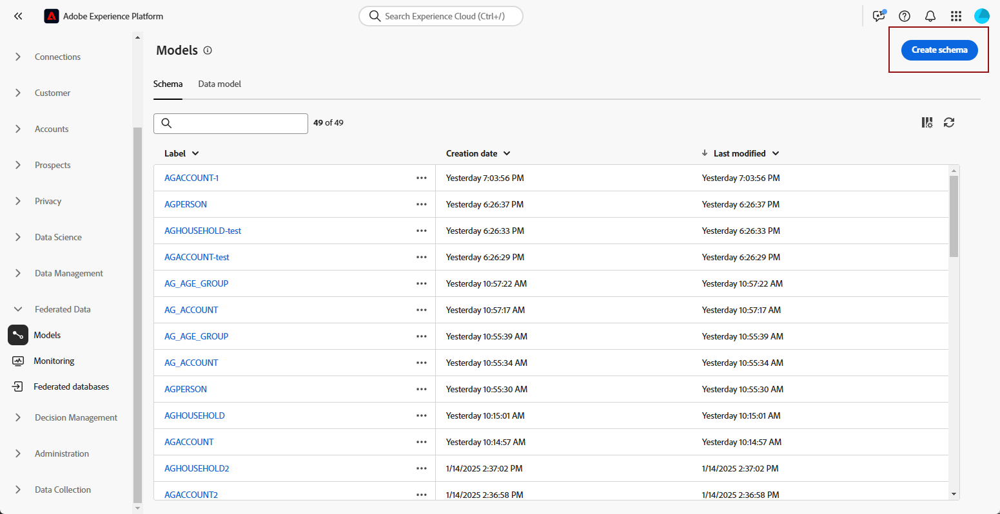

# Aan de slag met schema&#39;s {#schemas}

>[!AVAILABILITY]
>
>Voor toegang tot schema&#39;s hebt u een van de volgende machtigingen nodig:
>
>-**Beheer Verbond Schema**
>&#x200B;>-**Bekijk Verbond Schema**
>
>Voor meer informatie over de vereiste toestemmingen, te lezen gelieve de [ gids van de toegangscontrole ](/help/governance-privacy-security/access-control.md).

>[!CONTEXTUALHELP]
>id="dc_schema_create_select_tables"
>title="Tabellen selecteren"
>abstract="Selecteer de tabellen die u wilt toevoegen voor het gegevensmodel."

>[!CONTEXTUALHELP]
>id="dc_schema_create_key"
>title="Sleutel"
>abstract="Selecteer een sleutel voor de afstemming van gegevens."

>[!CONTEXTUALHELP]
>id="dc_schema_create_schema_name"
>title="Naam van het schema"
>abstract="Voer de naam van het schema in."

>[!CONTEXTUALHELP]
>id="dc_schema_edit_description"
>title="Beschrijving van schema"
>abstract="De schemabeschrijving maakt een lijst van kolommen, types en etiketten. U kunt ook de afstemmingssleutel voor het schema controleren. Klik op het potloodpictogram om de schemadefinitie bij te werken."

>[!CONTEXTUALHELP]
>id="dc_schema_filter_sources"
>title="Brondatabase selecteren om te filteren"
>abstract="U kunt de schema&#39;s filteren op basis van hun bron. Selecteer één of verscheidene Federated gegevensbestanden om hun schema&#39;s te tonen."

## Wat is een schema {#schema-start}

Een schema is een representatie van een tabel in uw database. Het is een object in de toepassing dat definieert hoe de gegevens aan databasetabellen zijn gekoppeld.

Door een schema te maken, kunt u een representatie van de tabel definiëren in de Experience Platform Federated Audience Composition:

* Geef deze een vriendelijke naam en beschrijving om het begrip voor de gebruiker te vereenvoudigen
* De zichtbaarheid van elk veld bepalen op basis van het werkelijke gebruik ervan
* Selecteer zijn primaire sleutel, om schema&#39;s tussen hen te verbinden, zoals nodig in het [ gegevensmodel ](../data-management/gs-models.md#data-model-start)

>[!CAUTION]
>
>Wanneer u meerdere sandboxen met dezelfde database verbindt, moet u afzonderlijke werkschema&#39;s gebruiken.

## Een schema maken {#schema-create}

Selecteer **[!UICONTROL Models]** in de sectie **[!UICONTROL Federated Data]** om een schema te maken in Federated Audience Composition. Selecteer **[!UICONTROL Schema]** op het tabblad **[!UICONTROL Create schema]** .

{zoomable="yes"}

De pop-up **[!UICONTROL Select federated database]** wordt weergegeven. Op dit popover, kunt u het [ brongegevensbestand ](/help/connections/home.md) selecteren, dat door **[!UICONTROL Next]** wordt gevolgd.

{zoomable="yes"}

**Uitgezochte Lijst** popover verschijnt. Op deze popover, kunt u de lijsten selecteren die u wilt gebruiken om het schema tot stand te brengen.

{zoomable="yes"}

Elke geselecteerde tabel genereert een schema met de gekozen kolommen. Voor elke tabel kunt u het label van het schema wijzigen, een beschrijving toevoegen, de naam van het veldlabel wijzigen, de zichtbaarheid van het veldlabel instellen en de primaire sleutel van het schema selecteren.

{zoomable="yes"}

>[!NOTE]
>
>Als u **[!UICONTROL Use Composite Key]** inschakelt maar slechts één toets selecteert die moet worden gebruikt, wordt de toets behandeld als een standaardschema met de primaire sleutel.

Bovendien, kunt u een sleutel tot stand brengen die uit veelvoudige schemakolommen wordt samengesteld. Schakel **[!UICONTROL Use Composite Key]** in en markeer de toetsen die u als samengestelde toets wilt gebruiken.

Nadat u de configuratie hebt voltooid, selecteert u **[!UICONTROL Done]** om het maken van het schema te voltooien.

## Een schema bewerken {#schema-edit}

Om een schema uit te geven, selecteer uw eerder gecreeerd schema op de **Schema&#39;s** pagina.

De pagina Schema-details wordt weergegeven. Selecteer het  om het schema uit te geven.

{zoomable="yes"}

Op het **[!UICONTROL Edit schema]** venster, kunt u tot de zelfde opties toegang hebben en vormen zoals wanneer [ creërend een schema ](#schema-create).

{zoomable="yes"}

## Gegevens voorvertonen in een schema {#schema-preview}

Blader naar het tabblad **[!UICONTROL Data]** zoals hieronder om een voorvertoning van de gegevens in de tabel weer te geven die door het schema wordt vertegenwoordigd.

Selecteer **[!UICONTROL Calculate]** koppeling om een voorvertoning weer te geven van het totale aantal opnamen.

{zoomable="yes"}

Selecteer de knop **[!UICONTROL Configure columns]** om de gegevensweergave te wijzigen.

{zoomable="yes"}

## Een schema vernieuwen {#schema-refresh}

Tabellen in een gefederaliseerde database kunnen worden bijgewerkt, toegevoegd of verwijderd. In dergelijke gevallen moet u het schema in Adobe Experience Platform vernieuwen om het uit te lijnen met de meest recente wijzigingen. Om dit uit te voeren, selecteer het  naast de naam van het schema dat door **[!UICONTROL Refresh schema]** wordt gevolgd.

U kunt de schemadefinitie ook bijwerken wanneer het uitgeven van het.

{zoomable="yes"}

## Schema verwijderen {#schema-delete}

Om een schema te schrappen, selecteer het , dat door **[!UICONTROL Delete]** wordt gevolgd.

{zoomable="yes"}
