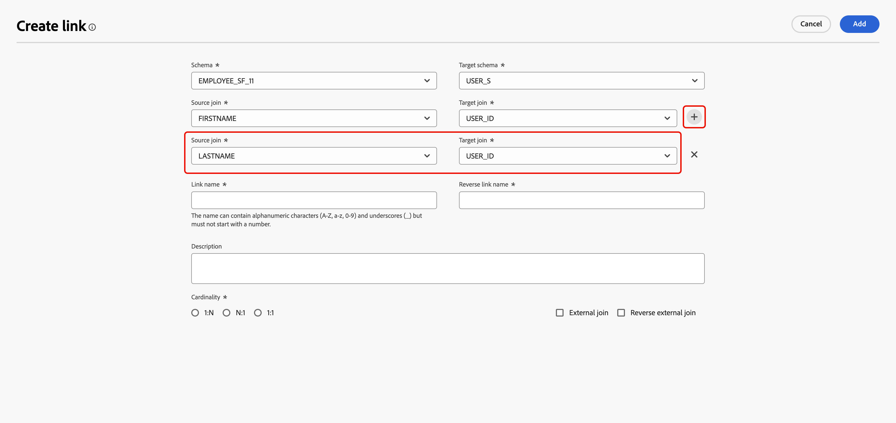

# Aan de slag met gegevensmodellen {#data-model-beta}

>[!AVAILABILITY]
>
>Voor toegang tot gegevensmodellen hebt u een van de volgende machtigingen nodig:
>
>- **beheer Federated Gegevensmodel**
>>- **Bekijk het Verbond Model van Gegevens**
>
>Voor meer informatie over de vereiste toestemmingen, te lezen gelieve de [ gids van de toegangscontrole ](/help/governance-privacy-security/access-control.md).

## Wat is een gegevensmodel {#data-model-start}

Een gegevensmodel is een reeks schema&#39;s, publiek, en de verbindingen tussen hen. Het wordt gebruikt om publiek met gegevensbestandgegevens te verbinden.

In Federated Audience Composition kunt u gegevensmodellen rechtstreeks in de Canvasweergave maken en beheren. Dit omvat het toevoegen van schema&#39;s en publiek, evenals het bepalen van de verbindingen tussen hen die op uw gebruiksgeval worden gebaseerd.

Leer meer over [ schema&#39;s ](../customer/schemas.md#schema-start) en [ publiek ](../start/audiences.md).

U ziet bijvoorbeeld onder een weergave van een gegevensmodel de tabellen met hun naam en de koppelingen daartussen.

{zoomable="yes"}

## Een gegevensmodel maken {#data-model-create}

Ga als volgt te werk om een gegevensmodel te maken:

1. Open in de sectie **[!UICONTROL Federated Data]** het menu **[!UICONTROL Models]** en blader naar de tab **[!UICONTROL Data model]** .

   Selecteer de knop **[!UICONTROL Create data model]**.

   {zoomable="yes"}

2. Definieer de naam van het gegevensmodel en selecteer **[!UICONTROL Create]** .

3. Selecteer in het dashboard van het gegevensmodel de optie **[!UICONTROL Add schemas]** om het schema te kiezen dat aan het gegevensmodel is gekoppeld.

   {zoomable="yes"}

4. Bovendien kunt u een publiek toevoegen aan uw gegevensmodel. Selecteer **[!UICONTROL Add Audiences]** om de doelgroepen te definiëren.

   {zoomable="yes"}

5. Vestig verbindingen tussen lijsten in uw gegevensmodel om nauwkeurige gegevensverhoudingen te verzekeren. Voor meer informatie, lees [ tot de sectie van verbindingen ](#data-model-links) leidt.

6. Nadat u de configuratie hebt voltooid, selecteert u **[!UICONTROL Save]** om de wijzigingen toe te passen.

## Koppelingen maken {#data-model-links}

>[!NOTE]
>
>Als u een verbinding met veelvoudige verbindingen creeert, kunt u de zelfde combinatie bron en doelschema&#39;s slechts eenmaal gebruiken.

>[!BEGINTABS]

>[!TAB  mening van de Lijst ]

Ga als volgt te werk als u koppelingen wilt maken tussen tabellen van uw gegevensmodel op het tabblad tabelweergave:

1. Selecteer het  dat door **[!UICONTROL Create link]** naast één van de lijst wordt gevolgd, of selecteer **[!UICONTROL Create links]** binnen de **[!UICONTROL Links]** sectie:

   {zoomable="yes"}

2. Vul het opgegeven formulier in om de koppeling te definiëren.

   {zoomable="yes"}

   **Kardinaliteit**

   * **1-n**: één voorkomen van de bronlijst kan verscheidene overeenkomstige voorkomen van de doellijst hebben, maar één voorkomen van de doellijst kan hoogstens één overeenkomstige voorkomen van de bronlijst hebben.

   * **n-1**: één voorkomen van de doellijst kan verscheidene overeenkomstige voorkomen van de bronlijst hebben, maar één voorkomen van de bronlijst kan hoogstens één overeenkomstige voorkomen van de doellijst hebben.

   * **1-1**: één voorkomen van de bronlijst kan hoogstens één overeenkomstige voorkomen van de doellijst hebben.

   Als u meerdere verbindingskoppelingen wilt maken, selecteert u het plusteken. U kunt nu meerdere verbindingen maken tussen de schemavelden.

   {zoomable="yes"}

Alle koppelingen die voor uw gegevensmodel zijn gedefinieerd, worden hieronder weergegeven:

{zoomable="yes"}

>[!TAB  mening van het Canvas ]

Ga als volgt te werk om koppelingen te maken tussen tabellen van uw gegevensmodel op het tabblad Canvasweergave:

1. Open de Canvasweergave van uw gegevensmodel en kies de twee tabellen die u wilt koppelen

2. Selecteer de knop  naast de Source-verbinding en sleep de pijl naar het doel om de verbinding tot stand te brengen.

   {zoomable="yes"}

3. Vul het opgegeven formulier in om de koppeling te definiëren en selecteer **[!UICONTROL Apply]** zodra dit is geconfigureerd.

   {zoomable="yes"}

   **Kardinaliteit**

   * **1-n**: één voorkomen van de bronlijst kan verscheidene overeenkomstige voorkomen van de doellijst hebben, maar één voorkomen van de doellijst kan hoogstens één overeenkomstige voorkomen van de bronlijst hebben.

   * **n-1**: één voorkomen van de doellijst kan verscheidene overeenkomstige voorkomen van de bronlijst hebben, maar één voorkomen van de bronlijst kan hoogstens één overeenkomstige voorkomen van de doellijst hebben.

   * **1-1**: één voorkomen van de bronlijst kan hoogstens één overeenkomstige voorkomen van de doellijst hebben.

4. Alle koppelingen die in het gegevensmodel zijn gedefinieerd, worden als pijlen weergegeven in de canvasweergave. Selecteer een pijl tussen twee tabellen om details weer te geven, bewerkingen uit te voeren of verwijder de koppeling naar wens.

   {zoomable="yes"}

5. Gebruik de werkbalk om het canvas aan te passen en aan te passen.

   

   * **[!UICONTROL Zoom in]**: vergroot het canvas om de details van uw gegevensmodel duidelijker te zien.
   * **[!UICONTROL Zoom out]**: verklein de canvasgrootte voor een bredere weergave van uw gegevensmodel.
   * **[!UICONTROL Fit view]**: pas het zoomniveau aan zodat alle schema&#39;s en/of doelgroepen in het zichtbare gebied passen.
   * **[!UICONTROL Toggle interactivity]**: Schakel gebruikersinteractie met het canvas in of uit.
   * **[!UICONTROL Filter]**: kies welk schema u wilt weergeven binnen het canvas.
   * **[!UICONTROL Force auto layout]**: schema&#39;s en/of publiek automatisch rangschikken voor een betere organisatie.

>[!ENDTABS]

## Video {#data-model-video}

Leer hoe u een gegevensmodel maakt in deze video:

>[!VIDEO](https://video.tv.adobe.com/v/3432020)
