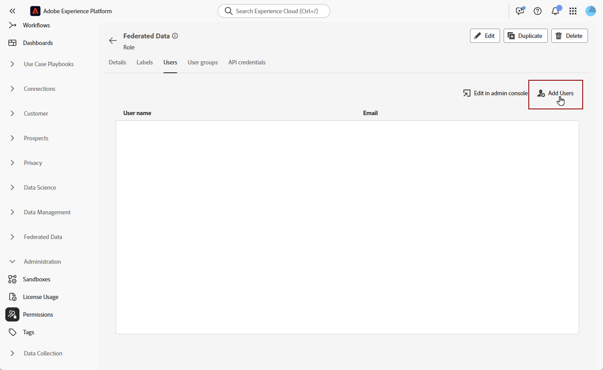

# Toegangsbeheer in Federale Audience Composition

U kunt toegangsbeheer gebruiken om op rol-gebaseerde toegang tot sandboxen en Federated Audience Composition te verlenen.

## Toegang tot sandboxen beheren {#access-sandboxes}

Wanneer u Adobe Experience Platform Federated Audience Composition aanschaft, wordt voor elke actieve sandbox op dat moment een productprofiel gemaakt. Dit productprofiel wordt gecreeerd in Admin Console onder **Adobe Experience Platform** productkaart en volgt deze noemende overeenkomst: `ACP_FAC - <<SandboxName>> - admin.` om tot de Federatieve Samenstelling van de Publiek voor een specifieke zandbak toegang te hebben, moeten de gebruikers aan het productprofiel worden toegevoegd dat voor die zandbak wordt gecreeerd.

Als bijvoorbeeld een nieuwe sandbox met de naam &quot;fac-test&quot; wordt geactiveerd, wordt een overeenkomstig productprofiel &quot;ACP_FAC - fac-test - admin&quot; gemaakt. Gebruikers moeten aan dit productprofiel worden toegevoegd om Federated Audience Composition met deze sandbox te kunnen benaderen.

## Toegang tot Federale Audience-compositie beheren

U kunt toegang beheren door de vereiste toestemmingen toe te wijzen om tot verschillende aspecten van de Samenstelling van de Publiek toegang te hebben. Deze toestemmingen worden toegewezen door rollen aan gebruikers die toegang tot **Federated de Samenstelling van het Publiek** nodig hebben.

>[!NOTE]
>
>Alleen beheerders kunnen machtigingen aan andere gebruikers toewijzen.

1. Navigeer naar het menu **[!UICONTROL Permissions]** .
1. Selecteer in het menu **[!UICONTROL Roles]** de **[!UICONTROL Role]** die u wilt bijwerken.

   

1. Selecteer **[!UICONTROL Edit]** om de machtigingen voor uw rol te wijzigen.

   

1. Voeg de vereiste machtigingen voor de gebruiker toe. U kunt de volgende toestemmingen voor toegang tot de Samenstelling van de Publiek toevoegen:

   | Machtiging | Beschrijving |
   | ---------- | ----------- |
   | Federale gegevens beheren | Gebruik deze toestemming om alle aspecten van de Samenstelling van de Publiek te beheren Federated. Met deze machtiging worden Federale database beheren, Federaal schema beheren, Federaal gegevensmodel beheren en Federale composities beheren overgeërfd. |
   | Federale database beheren | Gebruik deze machtiging om uw verbindingen met gefederaliseerde databases toe te voegen, weer te geven, bij te werken en te verwijderen. |
   | Federale database weergeven | Gebruik deze toestemming om uw verbindingen aan gefederaliseerde gegevensbestanden te bekijken. |
   | Federaal schema beheren | Met deze machtiging kunt u schema&#39;s maken, weergeven, bijwerken, verwijderen en vernieuwen. |
   | Federale schemagegevens weergeven | Gebruik deze machtiging om het gegevenstabblad weer te geven in de schemasectie. |
   | Federaal schema weergeven | Gebruik deze machtiging om de schematabellen weer te geven. |
   | Federaal gegevensmodel beheren | Met deze machtiging kunt u gegevensmodellen maken, weergeven, bijwerken en verwijderen. |
   | Federaal gegevensmodel weergeven | Gebruik deze machtiging om de gegevensmodellen weer te geven. |
   | Federation Audit Trail weergeven | Gebruik deze toestemming om het controlespoor voor de Samenstelling van de Publiek te bekijken Federated. |
   | Federale composities beheren | Met deze machtiging kunt u gefedereerde composities maken, weergeven, bijwerken en verwijderen. |
   | Federale composities weergeven | Gebruik deze machtiging om gefedereerde composities weer te geven. |

   

1. Selecteer **[!UICONTROL Save]** als u de benodigde wijzigingen hebt aangebracht.

Om het even welke gebruikers die reeds aan deze rol worden toegewezen zullen hun toestemmingen automatisch bijgewerkt hebben en toegang tot de Samenstelling van het Federale publiek.

Deze rol toewijzen aan nieuwe gebruikers:

1. Navigeer naar het tabblad **[!UICONTROL Users]** in het dashboard Rol en selecteer **[!UICONTROL Add Users]** .

   

1. Voer de naam of het e-mailadres van de gebruiker in of selecteer een van de beschikbare lijsten. Selecteer vervolgens **[!UICONTROL Save]** .

Alternatief, kunt u één van de reeds bestaande rollen aan de gebruikers toewijzen, afhankelijk van welke toestemmingen zij hebben vereist. Voor meer informatie bij het toewijzen van reeds bestaande rollen aan een gebruiker, gelieve te lezen de [ gids bij het beheren van gebruikers voor een productprofiel ](https://experienceleague.adobe.com/nl/docs/experience-platform/access-control/ui/users).

| Rolnaam | Machtigingen |
| --------- | ----------- |
| FAC-gegevensbeheer | <ul><li>Federale composities beheren</li><li>Federale databases weergeven</li><li>Federale schema&#39;s weergeven</li><li>Federale schemagegevens weergeven</li><li>Gedetailleerde gegevensmodellen weergeven</li></ul> |
| FAC-compositiemanagers | <ul><li>Federale composities beheren</li></ul> |
| FAC-beheerders | <ul><li>Federale gegevens beheren</li></ul> |

De gebruiker ontvangt vervolgens een e-mail met instructies om toegang te krijgen tot uw exemplaar. Als de gebruiker niet eerder werd gecreeerd, verwijs naar [ deze documentatie ](https://experienceleague.adobe.com/nl/docs/experience-platform/access-control/abac/permissions-ui/users).

## Toegang tot specifieke composities beheren

U kunt toegang tot een specifieke samenstelling beheren door toegangslabels toe te passen.

Voor meer informatie bij het toepassen van toegangslabels op een samenstelling, te lezen gelieve [ de sectie van toegangslabels ](/help/compositions/gs-compositions.md#access-labels) van de compositiegids toepassen.
