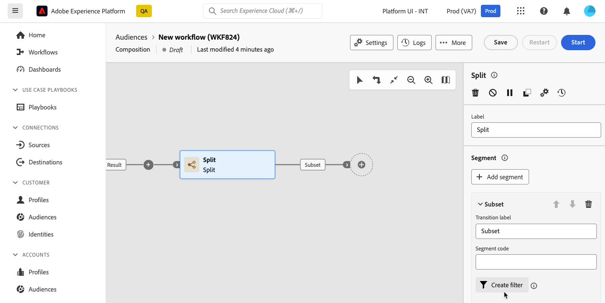

# Werken met de querymodeller {#segment-builder}

>[!CONTEXTUALHELP]
>id="dc_orchestration_querymodeler_querymessage"
>title="Querymodeller"
>abstract="Filtercriteria definiëren voor ontvangers of een ander schema, ook wel targetingdimensie genoemd, uit de database."

De querymodeller vereenvoudigt het filteren van de database op basis van verschillende criteria. Bovendien kan de querymodeller zeer complexe en lange query&#39;s efficiënt beheren, wat meer flexibiliteit en precisie biedt. Bovendien biedt de tool ondersteuning voor vooraf gedefinieerde filters binnen de voorwaarden, zodat u uw zoekopdrachten eenvoudig kunt verfijnen en tegelijkertijd geavanceerde expressies en operatoren kunt gebruiken voor uitgebreide doelgroep- en segmenteringsstrategieën.

## Toegang krijgen tot de querymodeller

De querymodeller is beschikbaar in elke context waar u regels moet definiëren om gegevens te filteren.

| Gebruik | Voorbeeld |
|  ---  |  ---  |
| **Definieer doelgroepen**: geef de doelgroep aan die u wilt selecteren in uw composities en creëer moeiteloos nieuwe doelgroepen die zijn afgestemd op uw behoeften. | {zoomable="yes"}{width="200" align="center" zoomable="yes"} |
| **Workflowactiviteiten** aanpassen: pas regels toe binnen compositieactiviteiten, zoals **Splitsen** en **Afstemming**, die moeten worden afgestemd op uw specifieke vereisten. [Meer informatie over compositieactiviteiten](../compositions/activities/about-activities.md) | {zoomable="yes"}{width="200" align="center" zoomable="yes"} |

## Interface van querymodeller {#interface}

De querymodeller biedt een centraal canvas waar u uw query kunt samenstellen en een rechterdeelvenster met informatie over de query.

{zoomable="yes"}

### Het centrale canvas {#canvas}

In het centrale canvas van de querymodeller kunt u verschillende componenten toevoegen en combineren om uw query samen te stellen. [Leer hoe u een query kunt samenstellen](build-query.md)

De werkbalk in de rechterbovenhoek van het canvas biedt opties om de querycomponenten eenvoudig te bewerken en op het canvas te navigeren:

* **Modus** Meervoudige selectie: Selecteer meerdere filtercomponenten die u wilt kopiëren en op de gewenste locatie plakken.
* **Roteren**: schakel het canvas verticaal om.
* **Aanpassen aan scherm**: pas het zoomniveau van het canvas aan uw scherm aan.
* **Uitzoomen** / **Inzoomen**: Zoom uit of op het canvas.
* **Kaart weergeven**: hiermee wordt een opname van het canvas geopend waarin wordt aantoont dat u zich bevindt.

### Het deelvenster Regeleigenschappen {#rule-properties}

Aan de rechterkant vindt u in het **[!UICONTROL Rule properties]** deelvenster informatie over uw vraag. Hiermee kunt u verschillende bewerkingen uitvoeren om de query te controleren en ervoor te zorgen dat deze aan uw behoeften voldoet. [Leer hoe u uw query kunt controleren en valideren](build-query.md#check-and-validate-your-query)
