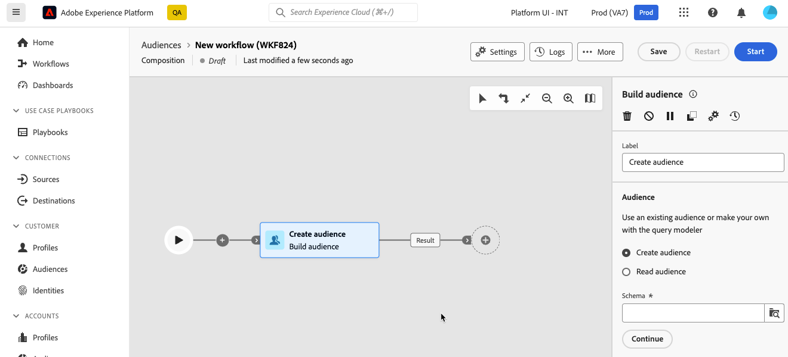

# Werken met de querymodelfunctie {#segment-builder}

>[!CONTEXTUALHELP]
>id="dc_orchestration_querymodeler_querymessage"
>title="Query-modelleraar"
>abstract="Bepaal het filtreren criteria voor ontvangers of om het even welke andere gericht afmeting van het gegevensbestand."

De vraagmodeler vereenvoudigt het proces om het gegevensbestand te filtreren dat op diverse criteria wordt gebaseerd. Bovendien, kan de vraagmodeler zeer complexe en lange vragen efficiënt beheren, die grotere flexibiliteit en precisie aanbieden. Bovendien ondersteunt het programma vooraf gedefinieerde filters binnen voorwaarden, waarmee u query&#39;s eenvoudig kunt verfijnen en geavanceerde expressies en operatoren kunt gebruiken voor uitgebreide doelgerichte en segmentatiestrategieën voor het publiek.

## Heb toegang tot de vraagmodeller

De vraagmodeler is beschikbaar in elke context waar u regels aan filtergegevens moet bepalen.

| Gebruik | Voorbeeld |
|  ---  |  ---  |
| **Soorten publiek definiëren**: Geef de doelgroep op in uw composities en maak moeiteloos nieuwe doelgroepen die aan uw behoeften zijn aangepast. | {zoomable="yes"}{width="200" align="center" zoomable="yes"} |
| **Workflowactiviteiten aanpassen**: regels toepassen binnen workflowactiviteiten, zoals **Splitsen** en **Verzoening**, om deze aan te passen aan uw specifieke vereisten. [Meer informatie over workflowactiviteiten](../compositions/activities/about-activities.md) | {zoomable="yes"}{width="200" align="center" zoomable="yes"} |
| **Vooraf gedefinieerde filters**: Maak vooraf gedefinieerde filters die als sneltoetsen fungeren tijdens diverse filterbewerkingen, ongeacht of u werkt met gegevenslijsten of het publiek vormt voor een levering. | {zoomable="yes"}{width="200" align="center" zoomable="yes"} |
| **Lijsten aanpassen**: Maak aangepaste regels om de gegevens te filteren die worden weergegeven in lijsten zoals ontvangers, leveringslijsten, enz. | {zoomable="yes"}{width="200" align="center" zoomable="yes"} |

## Query-modellerinterface {#interface}

De vraagmodeler verstrekt een centraal canvas waar u uw vraag bouwt, en een juiste ruit die informatie over uw vraag verstrekt.

{zoomable="yes"}

### Het centrale canvas {#canvas}

Het centrale canvas van de vraagmodeler is waar u toevoegt en de verschillende componenten combineert die uw vraag opbouwen. [Leer hoe u een query maakt](build-query.md)

De werkbalk in de rechterbovenhoek van het canvas bevat opties waarmee u de querycomponenten eenvoudig kunt manipuleren en op het canvas kunt navigeren:

* **Meerdere selectiemodus**: Selecteer meerdere filtercomponenten om deze op de gewenste locatie te kopiëren en te plakken.
* **Roteren**: Verander het canvas verticaal.
* **Aanpassen aan scherm**: Pas het zoomniveau van het canvas aan op het scherm.
* **Uitzoomen** / **Inzoomen**: Uitzoomen of op het canvas.
* **Kaart weergeven**: Hiermee opent u een opname van het canvas waarop u uw locatie ziet.

### Het deelvenster Eigenschappen van regel {#rule-properties}

Aan de rechterkant **[!UICONTROL Rule properties]** verstrekt informatie over uw vraag. Het staat u toe om diverse handelingen uit te voeren om de vraag te controleren en ervoor te zorgen het uw behoeften aanpast. [Leer hoe u uw query kunt controleren en valideren](build-query.md#check-and-validate-your-query)
