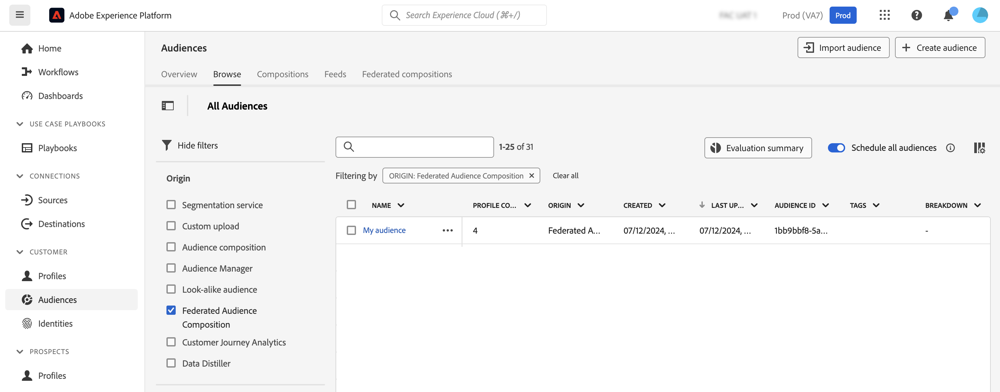

# Werken met het publiek {#gs-audiences}

Experience Platform Federated de Samenstelling van het Publiek staat u toe [ samenstellingen ](../compositions/gs-compositions.md) tot stand te brengen, waar u hefboomwerking diverse activiteiten in een visueel canvas kunt om publiek tot stand te brengen en hen op te slaan in het Portaal van het Publiek van Adobe Experience Platform.

U kunt deze doelgroepen vervolgens activeren in Journey Optimizer of activeren naar een bestemming die wordt ondersteund door Adobe Experience Platform.

## Het creëren van het publiek gebruikend samenstellingen {#creation}

Als u een publiek wilt maken met de compositie Federated Audience, moet u een compositie maken die een **[!UICONTROL Save audience]** -activiteit bevat. Deze activiteit staat u toe om het publiek in het Portaal van de Publiek op te slaan, en gebieden van uw externe gegevensbestanden te selecteren om in het publiek te omvatten. [ Leer hoe te om sparen publieksactiviteit ](../compositions/activities/save-audience.md) te vormen

Het publiek dat wordt gemaakt met behulp van Adobe Federated Data Composition bevat alle velden die zijn geselecteerd in de **[!UICONTROL Save audience]** -activiteit en wordt opgeslagen in het Poort Publiek naast alle Adobe Experience Platform-doelgroepen.

Na het uitvoeren van de samenstelling, wordt het resulterende publiek bewaard in Adobe Experience Platform als extern publiek, en beschikbaar in Adobe het Platform van Gegevens van de Klant in real time en/of Adobe Journey Optimizer.

U kunt deze soorten publiek activeren op elk doel dat door Adobe Experience Platform wordt ondersteund. Leer hoe te met bestemmingen in [ Adobe Experience Platform ](https://experienceleague.adobe.com/en/docs/experience-platform/destinations/home) te werken {target="_blank"}

>[!NOTE]
>
>Het publiek dat met Adobe Federated Audience Composition wordt gecreeerd kan niet worden uitgegeven. Als u wijzigingen wilt aanbrengen aan een van deze doelgroepen, moet u een nieuw publiek maken met een compositie.

## Open uw publiek in Adobe Experience Platform {#access-audience}

Het publiek dat gebruikend Federatieve Samenstelling van het Publiek wordt gecreeerd wordt toegankelijk gemaakt in het Portaal van het Publiek, dat van het **Publiek** menu toegankelijk is.

Op het tabblad **[!UICONTROL Browse]** worden alle bestaande soorten publiek weergegeven die in Adobe Experience Platform zijn opgeslagen. U kunt het publiek van de Samenstelling van de Federale Publiek in de lijst identificeren gebruikend de **[!UICONTROL Origin]** kolom of de filters beschikbaar in de linkerruit.

Voor meer informatie over hoe te om met publiek in Adobe Experience Platform te werken, verwijs naar [ Poortdocumentatie van het Poort van het Publiek ](https://experienceleague.adobe.com/en/docs/experience-platform/segmentation/ui/audience-portal) {target="_blank"}

<!-- add link to this donc once published: https://jira.corp.adobe.com/browse/PLAT-198674-->