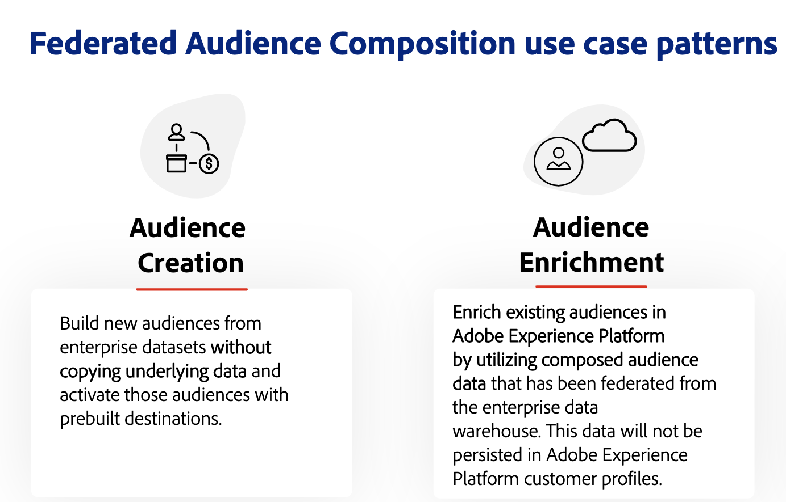

# Aan de slag met Federatieve Audience Composition {#gs-fac}

De federatieve Samenstelling van het Publiek is een toe:voegen-op vermogen voor [ Adobe Real-time Customer Data Platform ](https://experienceleague.adobe.com/en/docs/experience-platform/segmentation/home) {target="_blank"} en [ Adobe Journey Optimizer ](https://experienceleague.adobe.com/en/docs/journey-optimizer/using/ajo-home) {target="_blank"} dat u toestaat om publiek van uw derdegegevenspakhuizen te bouwen en te verrijken en het publiek in Adobe Experience Platform in te voeren. De Federatieve Samenstelling van het Publiek brengt een gemakkelijke en krachtige oplossing om uw entrepot van ondernemingsgegevens direct binnen Adobe Real-time Customer Data Platform en/of Adobe Journey Optimizer te verbinden, en vragen op de lijsten van uw gegevenspakhuis uit te voeren.

Met Adobe Federated Audience Composition kunnen gebruikers van Adobe Experience Platform-apps toegang krijgen tot hun klantgegevens die zijn opgeslagen in hun gegevenspakhuizen en platforms voor cloudopslag, zoals Amazon Redshift, Azure synapse Analytics en meer. De gegevens van de klant kunnen in veelvoudige gegevenspakhuizen leven en zijn nu onmiddellijk toegankelijk, zonder replicatie. De gesteunde platforms zijn vermeld in [ deze pagina ](../connections/federated-db.md#supported-db).

## Mogelijkheden {#rn-capabilities}

Federated Audience Composition breidt de waarde van Real-Time CDP en Journey Optimizer uit met een uitgebreide benadering van publiekscurve en activering:

* Breid toegang tot kritieke pakhuis-gebaseerde datasets uit om een publiek van hoge waarde tot stand te brengen: Gebruikt bestaande gegevenspakhuizen als belangrijkste systeem van verslag, terwijl het leveraging van best-in-klassentoepassingen om grote klantenervaringen te drijven.

* Uitgebreide ondersteuning voor het gebruik van zaken voor betrokkenheid bij energieverbruik: Federated Audience Composition, in combinatie met Real-Time CDP of Journey Optimizer, ondersteunt door het merk geïnitieerde, gepersonaliseerde ervaringen met een federaal publiek en biedt actuele ervaringen die worden geactiveerd door real-time gebeurtenissen, in combinatie met persoonlijke kenmerken om te voldoen aan gebruikscasevereisten voor verschillende teams.

* Minimaliseer gegevensbeweging en duplicatie: maak een publiek op van gegevenssets die in een bedrijfsgegevenspakhuis wonen zonder onderliggende gegevens te kopiëren om handelingsprofielen en publiek te beheren.

* Maak gebruik van één systeem voor ervaren workflows: zorg dat ingeslikte en gefedereerde doelgroepen in Adobe Experience Platform worden gekruld en dat uitgaande ervaringen op alle kanalen worden gecoördineerd.

## Gebruiksscenario’s {#rn-uc}

Door marketing-vriendschappelijke UI, creeer segmentregels die uw gegevenspaket voor een lijst van gebruikers vragen die voor een specifiek segment nodig voor marketing campagnes, toegang tot bestaand publiek in het pakhuis voor activering kwalificeren, of verrijken het publiek van Adobe Experience Platform met extra datapoints die in het pakhuis bestaan.

In deze versie zijn twee gebruiksgevallen beschikbaar:

1. Het Maken van het publiek: Bouw nieuw publiek van ondernemingsdatasets zonder onderliggende gegevens te kopiëren en die publiek met prebuilt bestemmingen te activeren.

1. Verrijking van het publiek: Verrijken bestaand publiek in Adobe Experience Platform door samengestelde publieksgegevens te gebruiken die van het entrepot van ondernemingsgegevens zijn gefedereerd. Deze gegevens blijven niet behouden in Adobe Experience Platform-klantprofielen.

{zoomable="yes"}{width="75%" align="center"}

## Belangrijkste stappen {#gs-steps}

Met Adobe Federated Audience Composition kunt u Adobe Experience Platform-soorten publiek rechtstreeks vanuit uw database maken en bijwerken, zonder dat er iets hoeft te worden ingevoerd.

<!--{zoomable="yes"}{width="85%" align="center"}-->

Belangrijkste stappen:

1. **Integratie van Gegevens**: Breng gegevens van diverse bronnen samen, en voeg hen in een verenigde dataset samen. Leer hoe te om Adobe Experience Platform te verbinden apps en uw entrepot van ondernemingsgegevens, gesteunde gegevensbestanden, en hoe te om hen te vormen zijn gedetailleerd in [ deze sectie ](../connections/federated-db.md).

1. **Modellering van Gegevens**: Ontwerp en creeer gegevensmodellen en schema&#39;s die de structuur, de verhoudingen, en de beperkingen van de gegevens bepalen. Leer meer over schema&#39;s in [ deze pagina ](../customer/schemas.md). Leer hoe te om verbindingen voor uw datamodel in [ tot stand te brengen deze pagina ](../data-management/gs-models.md).

1. **Transformatie van Gegevens**: Pas de technieken van de gegevensmanipulatie toe om het formaat, de structuur, of de waarden van gegevenselementen te wijzigen om hen compatibel of geschikt voor specifieke analyse of toepassingen te maken.

1. **Gebruik van Gegevens**: Creeer, orkestel en bouw publiek. Leer hoe te om publiek in [ samen te stellen deze pagina ](../compositions/gs-compositions.md). U kunt bestaande doelgroepen ook bijwerken of opnieuw gebruiken via het Adobe Experience Platform Audience-portaal en de Doelen. Leer meer in [ deze pagina ](../connections/destinations.md)

>[!NOTE]
>
>Na het uitvoeren van de samenstelling, wordt het resulterende publiek bewaard in Adobe Experience Platform als extern publiek, en beschikbaar in Adobe het Platform van Gegevens van de Klant in real time en/of Adobe Journey Optimizer. Het wordt toegankelijk gemaakt in het **publiek** menu. [ leer meer ](https://experienceleague.adobe.com/en/docs/experience-platform/segmentation/ui/audience-portal) {target="_blank"}

## Meer informatie {#learn}

<!-- Workflow + Workflow activities-->

Leer hoe te om tot de Verbond van de Auditie van het Publiek, guardrails en beperkingen in [ toegang te hebben deze pagina ](access-prerequisites.md).

Zie ook vaak gestelde vragen in [ deze pagina ](faq.md).

>[!CONTEXTUALHELP]
>id="dc_workflow_settings_execution"
>title="Instellingen voor uitvoering"
>abstract="In deze sectie, kunt u montages met betrekking tot de uitvoering van het werkschema vormen, zoals het aantal dagen de samenstellingsgeschiedenis wordt gehouden."

>[!CONTEXTUALHELP]
>id="dc_orchestration_query_enrichment_noneditable"
>title="Activiteit niet bewerkbaar"
>abstract="Wanneer de a **Vraag** of een **Verrijking** activiteit met extra gegevens in de console wordt gevormd, wordt het verrijkingsgegeven genomen en overgegaan in de uitgaande overgang, maar het kan niet worden uitgegeven."

<!-- Create a link -->

>[!CONTEXTUALHELP]
>id="dc_federated_database_create_link"
>title="Een koppeling maken"
>abstract="Geef de koppelingsinstellingen op."
